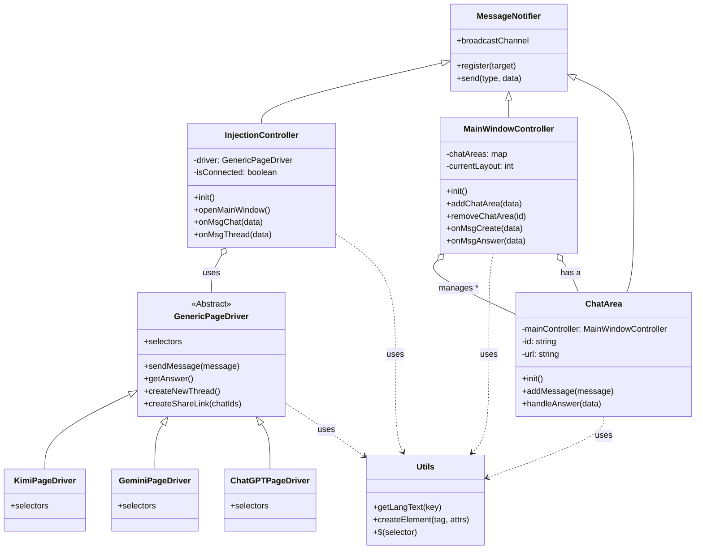
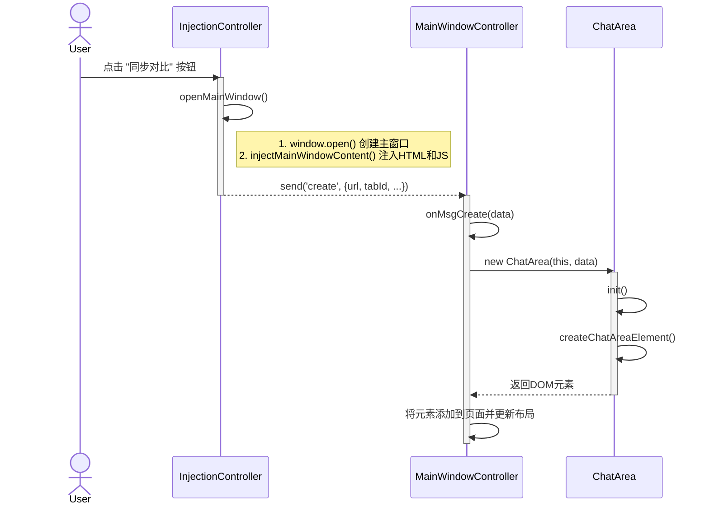
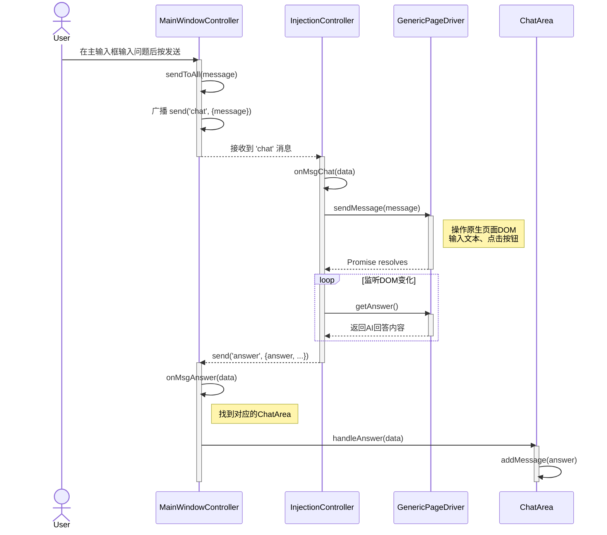
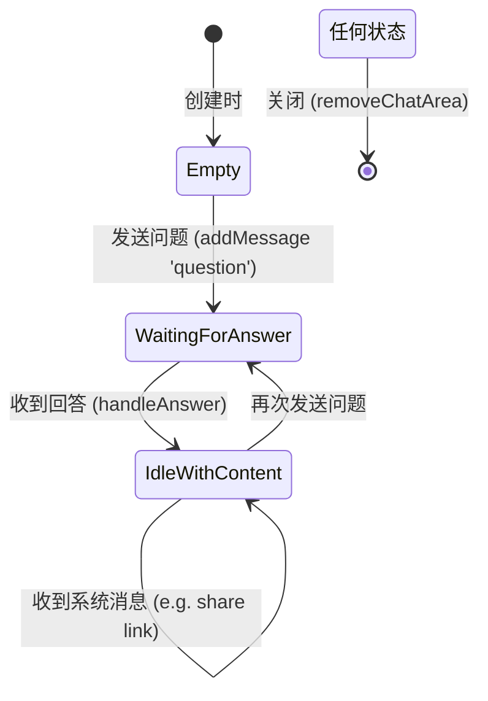

# 系统设计文档 (4+1视图模型)

本文档使用4+1视图模型来描述“多AI同步聊天”油猴脚本的系统架构。

## 1. 逻辑视图 (Logical View)

逻辑视图关注系统的功能和结构，展示了主要的类、它们的职责以及它们之间的关系。

### 核心类及其职责

-   **`MessageNotifier`**: 通信基类。使用 `BroadcastChannel` API 实现跨窗口/Tab的发布/订阅消息传递。它提供了一个 `register` 方法，能自动将目标对象上所有 `onMsg*` 开头的方法注册为消息处理器，实现了“约定优于配置”。
-   **`InjectionController`**: 运行在原生AI页面。继承自 `MessageNotifier`。负责向页面注入“同步对比”按钮，并根据当前网址创建一个合适的 `PageDriver`。它作为原生页面与主窗口之间的桥梁，监听主窗口的指令（如`chat`）并调用`PageDriver`执行，同时监听`PageDriver`返回的结果（如`answer`）并发送回主窗口。
-   **`MainWindowController`**: 运行在主窗口。继承自 `MessageNotifier`。是主窗口的核心控制器，负责管理窗口布局、接收并处理来自原生页面的消息（如`create`, `answer`），并管理所有 `ChatArea` 实例的生命周期。
-   **`ChatArea`**: 运行在主窗口。继承自 `MessageNotifier`。代表主窗口中的一个独立的AI对话面板。它由 `MainWindowController` 创建和管理，负责渲染自身的UI（标题、对话内容、按钮等），并处理与单个AI会话相关的用户交互。
-   **`GenericPageDriver`**: 页面驱动的基类（抽象类）。定义了所有具体AI页面驱动必须实现的接口（契约），如 `sendMessage`, `getAnswer`, `createNewThread` 等。它封装了在AI页面上执行通用操作的逻辑。
-   **`KimiPageDriver`, `GeminiPageDriver`, `ChatGPTPageDriver`**: 具体的页面驱动。它们继承自 `GenericPageDriver`，并为特定的AI网站（如Kimi、Gemini）重写了选择器（`selectors`）和部分方法，以适配不同网站的DOM结构。
-   **`Utils`**: 工具类。提供DOM操作（如 `$`）、元素创建、国际化文本获取等通用辅助功能。
-   **`I18n`**: 国际化类。存储所有支持语言的UI文本。

### 类图 (Class Diagram)

## 2. 进程视图 (Process View)

进程视图关注系统的运行时行为，特别是并发和通信。

本系统主要涉及两个独立的运行时上下文（进程/线程）：

1.  **原生AI页面脚本**: 在每个匹配的AI聊天页面（如 `chatgpt.com`）中运行的油猴脚本实例。`InjectionController` 是这个上下文的核心。
2.  **主窗口脚本**: 在新打开的、名为 `multi-ai-sync-chat-window` 的独立Tab/窗口中运行的脚本。`MainWindowController` 是这个上下文的核心。

这两个上下文通过 `BroadcastChannel` API 进行异步、双向的通信。

### 场景1: 启动同步与创建内容块

下面的顺序图展示了用户首次在AI页面点击“同步对比”按钮时的交互流程。

### 场景2: 从主窗口发送消息并接收回复

下面的顺序图展示了用户在主窗口的全局输入框中提问，然后各个AI页面响应并返回答案的流程。

### ChatArea 状态图

一个 `ChatArea` 对象在其生命周期中存在几种状态。

## 3. 开发视图 (Development View)

开发视图描述了代码的组织结构。源代码位于 `src` 目录下，结构清晰，职责分明。

-   `index.js`: **入口文件**。脚本的起点，判断当前页面环境并初始化 `InjectionController`。
-   `message.js`: **通信层**。定义了 `MessageNotifier` 基类，封装了 `BroadcastChannel` 通信。
-   `injection-controller.js`: **注入控制器**。负责在原生AI页面注入UI、创建驱动和主窗口，并作为消息中继。
-   `main-window-controller.js`: **主窗口控制器**。管理主窗口的UI、布局和所有 `ChatArea` 实例。
-   `chat-area.js`: **UI组件**。表示主窗口中的一个对话面板，管理自身的UI和事件。
-   `generic-page-driver.js`: **驱动抽象层**。定义了所有页面驱动的通用接口和基础实现。
-   `drivers.js`: **驱动实现**。包含所有特定AI网站的驱动实现（`KimiPageDriver` 等）。
-   `utils.js`: **工具库**。提供全局可用的辅助函数。
-   `i18n.js`: **国际化库**。存储多语言文本资源。

## 4. 物理视图 (Physical View)

物理视图描述了软件如何部署和运行。

-   **部署单元**: 整个项目通过 `webpack` 打包成一个单一的 `.user.js` 文件。
-   **部署环境**: 这个 `.user.js` 文件被安装到用户浏览器的油猴脚本管理器扩展中（如 Tampermonkey, Greasemonkey）。
-   **运行时**:
    1.  当用户访问在 `userscript.meta.js` 中 `@match` 规则定义的一个AI网站时，脚本管理器会将该 `.user.js` 注入到该页面，创建一个 `InjectionController` 实例。
    2.  当用户点击“同步对比”按钮时，`InjectionController` 会动态创建一个新的浏览器窗口/Tab（主窗口），并通过 `document.write` 将主窗口的完整HTML和JS（包括 `MainWindowController` 等类的源码）写入其中，从而启动第二个运行时环境。

## +1. 场景视图 (Scenarios)

场景视图通过关键用例将以上四个视图联系起来。核心场景已在 **进程视图** 的顺序图中详细描述：

1.  **首次同步**: 用户在任意一个受支持的AI网站上，点击“同步对比”按钮，脚本会自动打开一个主窗口，并在其中为该AI创建一个对话面板。
2.  **多路提问**: 用户在主窗口底部的通用输入框中输入一个问题并发送，该问题会被同时发送到所有已打开的对话面板对应的原生AI网站。
3.  **汇总答案**: 每个AI网站生成答案后，原生页面中的脚本会捕获到新内容，并将其发送回主窗口，主窗口在对应的对话面板中渲染出该答案。

这种设计实现了核心目标：将多个独立的AI会话聚合到一个统一的界面中进行同步交互和对比。
