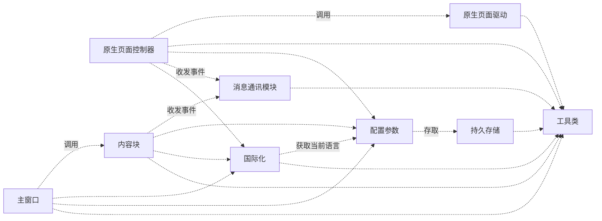

# 总体架构描述

## 📋 概述

- 本文的描述内容必须遵循基础规则 [GEMINI.MD](../GEMINI.MD) 的约束。
- 所有的其他设计文档，都不能违背本文的总体架构设计，除非特别指出。
- 本文的还可以的是所有模块都必须遵守的原则、技术、接口或者相关规范。

## 名词定义

- ai对话页面：也叫做原生页面，是浏览器中输入`url`访问到的ai服务提供商的对话页面
- ai会话：在ai对话页面中一轮跟特定主题相关的多次人机对话的所有问答内容
- 主窗口：包含多个内容块的新页面，该窗口名字为`multi-ai-sync-chat-window`
- 内容块：也叫`chatarea`，对应一个ai会话，包含一些控制部件

## **设计原则**

- **模块化**：每一个模块都对应一个模块同名的设计文档。例如多语言模块`i18n`对应设计文档就是`i18n.md`。

- **通讯**：不同窗口之间的部件全部通过专门的通讯机制进行，不能直接调用。

- **封装**：对于具有共性的特征，需要进行封装。例如：为每个支持的 AI 网站编写一个独立的 `PageDriver`（如 `KimiPageDriver`, `GeminiPageDriver`）。这些驱动继承自一个通用的 `GenericPageDriver`，封装了与特定网站 DOM 交互的细节（如定位输入框、获取回答内容、获取历史会话列表、获取当前对话标题等等）。

- **国际化**：默认支持多语言，UI 文字内容全部用 `key` 引用。根据浏览器当前语言切换，要注意阿拉伯语的从右向左的写作方式的支持。

## 整体架构

### 模块划分

* 工具类（util）：存放一些DOM操作、浏览器或油猴的接口等功能函数。
* 配置参数（config）：负责提供配置参数的存储和修改，支持默认参数的设置和还原
* 持久存储（storage）：负责封装localstorage机制，提供配置参数的持久化存储和读取能力
* 消息通讯模块（message）：负责跨页面、跨窗口、跨网站的消息的发布和订阅
* 国际化模块（i18n）：负责国际化文字的提取、国际化的切换、页面国际化的检测等功能
* 原生页面驱动（page-driver）：负责在原生页面中注入“同步对比”按钮、监听内容变化、对接提示词输入框、获取回答内容等。
* 原生页面控制器（page-controller）：通用的原生页面控制逻辑，负责在内容变化时候发起通知，检测并创建主窗口，响应主窗口的通讯消息等。
* 主窗口（sync-chat-window）：负责多AI模型同时对话和结果对比。
* 内容块（chat-area）：负责单个AI模型的对话和内容结果同步，通过通讯模块和原生页面控制器进行通讯。

### 模块依赖关系

以下是模块之间依赖关系的图形表示：



## 主要业务逻辑

1. 原生页面修饰，包括注入“同步按钮”、选择并使用匹配的AI供应商驱动
2. 在用户点击同步按钮的时候，创建或激活主窗口逻辑，实现布局和内容块的管理
3. 同步内容块和原生页面的内容。

## 💡 常见任务示例

### 示例1：添加对新 AI 网站的支持 (例如 claude.ai)

**用户问题**: "我需要为 'claude.ai' 添加同步支持。"
**期望回答**:
好的。为了支持一个新的 AI 网站，我们需要创建一个新的“页面驱动 (PageDriver)”。这可以分为以下几步：

1. **创建驱动文件**: 在 `src/` 目录下创建一个新文件 `claude-page-driver.js`。
2. **实现驱动逻辑**: 在 `claude-page-driver.js` 中，创建一个 `ClaudePageDriver` 构造函数，并让它继承自 `GenericPageDriver`。然后，你需要实现或重写特定于 `claude.ai` 的方法，例如：
    - `getChatInput()`: 返回聊天输入框的 DOM 元素。
    - `getSendButton()`: 返回发送按钮的 DOM 元素。
    - `getLastResponseElement()`: 返回 AI 生成的最新回答所在的容器元素。
    - `getChatHistory()`: 获取并格式化历史聊天记录。
3. **注册新驱动**: 打开 `src/drivers.js` 文件，在驱动映射表中添加新的条目，将 `claude.ai` 的 URL 模式映射到你刚刚创建的 `ClaudePageDriver`。

```javascript
// src/drivers.js
...
'chat.lmsys.org':        require('./vicuna-page-driver'),
'www.claude.ai':         require('./claude-page-driver'), // 新增此行
'*':                     require('./generic-page-driver'),
...
```

4. **更新默认配置**: （可选）在 `main-window-controller.js` 中找到默认的 `providers` 列表，并将 Claude 添加进去，这样新用户在安装脚本后就能直接使用。

这种基于驱动的架构将特定网站的逻辑隔离开来，使得添加新网站变得非常简单，而无需改动核心代码。

### 在JS中生成HTML

**用户问题**：我需要用js生成一个弹出式窗口包含特定功能的html

**期望回答**：

好的，为了生成一个新的html页面，我们需要包含如下的步骤：

1. 为页面特定的js创建特有的文件，一般命名为 `ABC_Script.js`，其中包含了所有该窗口需要的函数和类定义，并为其生成测试用例，确保工作正确。

2. 为页面创建html生成的代码片段，不要在其中直接嵌入javascript语句，而是用Function.toString嵌入源码，示例代码：

```javascript
const abc_html = `
    <html>
        <head><title>abc</title></head>
        <body>
            <div id="a1" style="color:red">
                <span>hello</span>
            </div>
            <div id="a2">world!</div>
            <script>${ABC_Script.toString()}</script>
        </body>
    </html>
`;
```

3. 在当前js脚本文件中创建一个专门的function用于生成窗口`function createABCWin(){...}`，把以上的代码包含进去
