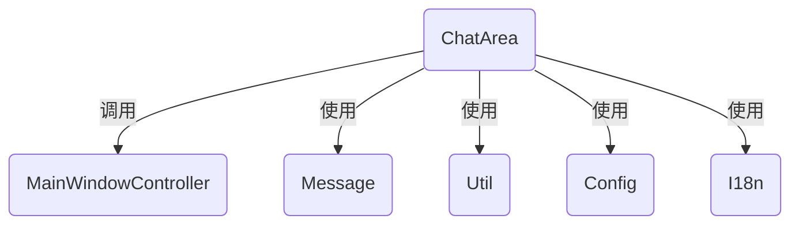
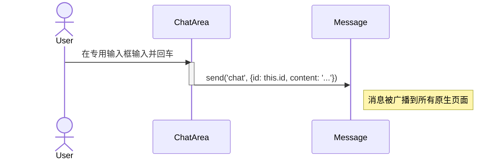
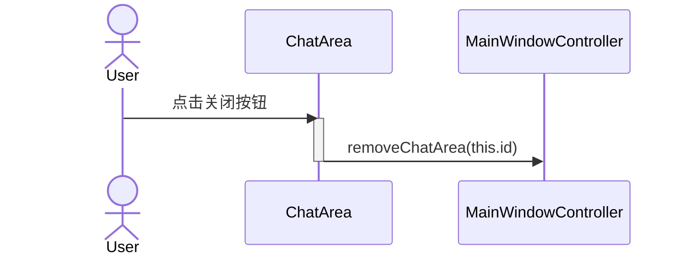

# 内容块 (ChatArea) 设计文档

本文档遵循 [../GEMINI.MD](../GEMINI.MD) 和 [architect.md](./architect.md) 中的规范。

## 1. 逻辑视图 (Logical View)

### 模块职责

`ChatArea` 是主窗口中的一个核心 UI 组件，它代表一个与特定原生 AI 页面的同步会话。每个 `ChatArea` 都是一个独立的、自包含的单元。其主要职责是：

1.  **UI 渲染与管理**: 负责渲染自身的全部 UI，包括顶部的标题栏（AI 名称、关闭按钮、分享按钮等）、中间的对话内容区域和底部的专用输入框（按需显示）。
2.  **状态管理**: 管理与单个 AI 会话相关的状态，如会话 ID (`id`)、对应的原生页面 URL (`url`)、AI 提供商名称 (`name`) 等。
3.  **用户交互处理**: 处理针对该内容块的特定用户操作，例如点击关闭按钮、切换 AI 提供商、使用专用输入框发送消息等。
4.  **内容展示**: 接收由 `MainWindowController` 路由过来的消息（如新答案、系统通知），并将其格式化后显示在对话内容区域。
5.  **与控制器通信**: 当需要执行会影响其他模块的操作时（如关闭自身、发送消息），它会调用父级 `MainWindowController` 提供的方法或通过 `Message` 模块发送消息。

### 核心类与依赖

-   **`ChatArea`**: 核心 UI 组件类。
-   **依赖关系**:
    -   `MainWindowController`: 其父级容器和控制器，通过它进行部分通信。
    -   `Message`: 用于发送消息到原生页面（例如，通过专用输入框发送问题）。
    -   `Util`: 用于 DOM 操作和 UI 创建。
    -   `Config`: 用于获取配置信息。
    -   `I18n`: 用于显示国际化的 UI 文本。



## 2. 过程视图 (Process View)

`ChatArea` 实例由 `MainWindowController` 在收到 `create` 消息时创建。它的生命周期完全由 `MainWindowController` 控制。

### 布局和交互逻辑说明

ChatArea包含区域从上到下为如下区域：

* 标题，该标题为永久显示，其内容分左右两个水平区域，包含的是工具条
  * 左区：全部左对齐，依次包含：
    * 大模型名称，该名称可下拉切换成其他大模型
    * 新会话，点击就废弃当前区域内的会话，创建一个新会话
  * 右区：全部右对齐，从左到右依次为：
    * 大模型配置参数，下拉出现大模型相关的各种配置参数，包括模型版本切换。
    * 分享按钮，点击跳转到原生窗口
    * 固定按钮，pin住窗口，在布局切换的时候放到布局的前面
    * 关闭按钮，点击关闭区域。
* 对话区，存放问题和回答内容。该区域水平分为两个部分：
  * 索引：垂直窄条，前两个是展开和折叠全部回答的按钮，其后显示数字1、2、3、4的索引，每个数字对应回答的序号，点击跳到回答。索引永远悬浮，不随内容区的滚动变化。
  * 内容区：用气泡显示问题和回答，问题气泡靠右，回答气泡靠左。鼠标悬浮到当前气泡的时候展示工具条，包含展开/折叠按钮（根据当前折叠情况而定）、复制。内容区如果内容变多的话，要有滚动条。
* 输入区，动态显示和隐藏的区域，从左到右包含一个提示词文本框和一个发送按钮。发送按钮固定大小并靠右，文本框负责充满剩余区域。平时输入区是隐藏不占用空间，变成一个贴底部居中且悬浮半透明的“输入区”小方块，鼠标移动到方块上面时候，展开全部输入区，但是依然是半透明和悬浮的，且不占用ChatArea，当鼠标点击聚焦文本框的时候，输入区会变成不透明并嵌入到区域中，对话区会自动上移留出空间。此时用户可以手工输入内容。如果此时文本框失去焦点，在0.5秒内输入区又会变回悬浮，然后1秒内缩成小方块。等待下一次鼠标激活。不过输入的文本内容依然会保留，在下一次时候显示。

### 交互示例：通过专用输入框发送消息



### 交互示例：点击关闭按钮



## 3. 开发视图 (Development View)

### 文件结构

-   `src/chat-area.js`: `ChatArea` 模块的源代码。
-   `tests/chat-area.test.js`: `ChatArea` 模块的单元测试。

### API 定义

```javascript
/**
 * @description 主窗口中的单个对话面板。
 * @param {MainWindowController} mainController - 父控制器实例。
 * @param {string} id - 唯一标识符。
 * @param {string} url - 对应的原生页面 URL。
 * @param {HTMLElement} container - 对话面板对应的容器对象
 */
function ChatArea(mainController, id, url, container) {
    this.mainController = mainController;
    this.id = id;
    this.url = url;
    this.element = container; // 根 DOM 元素

    /**
     * @description 初始化，创建并返回 DOM 元素。
     * @returns {HTMLElement}
     */
    this.init = function() { /* ... */ };

    /**
     * @description 处理来自控制器的答案更新。
     * @param {object} data - 答案数据。
     */
    this.handleAnswer = function(data) { /* ... */ };

    /**
     * @description 将一条消息（问题或答案）添加到视图中。
     * @param {string} content - 消息内容。
     * @param {string} type - 消息类型 ('question' or 'answer')。
     */
    this.addMessage = function(content, type) { /* ... */ };

    /**
     * @description 销毁自身，移除 DOM 和事件监听器。
     */
    this.destroy = function() { /* ... */ };
}
```

## 4. 物理视图 (Physical View)

`ChatArea` 的代码与 `MainWindowController` 一起，被动态注入到主窗口的上下文中。它在物理上表现为 `MainWindowController` DOM 树中的一个子节点（一个 `<div>` 元素）。

## +1. 场景视图 (Scenarios)

### 场景：一个答案从原生页面到达对应的 ChatArea

1.  `GeminiPageDriver` 在 Gemini 页面上检测到一个新的答案，并通过 `PageController` 和 `Message` 模块发送了一个 `answer` 消息，消息中包含 `id` (标识符) 和 `content` (答案文本)。
2.  `MainWindowController` 接收到此 `answer` 消息。
3.  `MainWindowController` 调用 `this.chatAreas.get(id)`，根据 `id` 找到了对应的 `ChatArea` (Gemini) 实例。
4.  `MainWindowController` 调用该实例的 `chatArea.handleAnswer({ content: '...' })` 方法。
5.  `handleAnswer` 方法内部调用 `this.addMessage(content, 'answer')`。
6.  `addMessage` 方法创建一个新的 `div` 元素，将答案的 Markdown 文本转换为 HTML，然后将其追加到该 `ChatArea` 的对话内容区域，并自动滚动到底部。

## **研究工作**

本模块比较简单，无特别研究工作

## **测试用例设计**

本模块的测试用例将围绕一个包含所有UI元素的`ChatArea`实例进行，外部依赖（如`MainWindowController`和`Message`）将被模拟。

1.  **初始化测试**：创建一个新的`ChatArea`实例后，其对应的DOM容器内应包含完整的UI结构，如标题栏、空的对话区和隐藏的输入区占位符。
2.  **内容显示测试**：调用`addMessage`方法添加一个问题后，对话区应出现一个右对齐的“问题气泡”。接着调用`handleAnswer`添加一个回答后，应出现一个左对齐的“回答气泡”。
3.  **关闭功能测试**：模拟点击标题栏的“关闭”按钮，应触发对`MainWindowController.removeChatArea`方法的调用。
4.  **新会话功能测试**：模拟点击“新会话”按钮，当前对话区的内容应被清空，并准备接收新的对话。
5.  **输入区显隐逻辑测试**：
    - 鼠标悬浮在底部中央的占位符上时，输入区应展开为半透明悬浮状态。
    - 点击输入框使其获得焦点后，输入区应变为不透明的嵌入式布局，并将上方的对话区推高。
    - 输入框失去焦点后，应在短暂延迟后恢复为悬浮状态，最终缩回为占位符。
6.  **消息发送测试**：在输入区输入文本“你好”，然后模拟点击发送按钮，应触发`Message.send`方法，且发送的消息类型为`chat`，内容包含文本“你好”和当前`ChatArea`的`id`。
7.  **对话索引测试**：当对话区包含多个问答后，模拟点击右侧的数字索引（如“2”），对话区应平滑滚动到第二个回答的位置。
8.  **内容折叠/展开测试**：模拟点击单个回答气泡上的“折叠”按钮，该气泡内容应被隐藏。模拟点击对话索引区的“全部折叠”按钮，所有回答气泡的内容都应被隐藏。
9.  **销毁逻辑测试**：调用`destroy`方法后，`ChatArea`所占用的DOM容器其`innerHTML`应变为空，且所有相关事件监听器都应被移除。

## 附录

无附录

