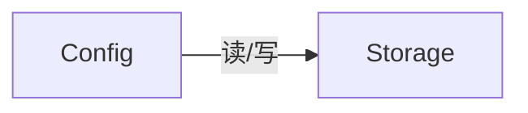
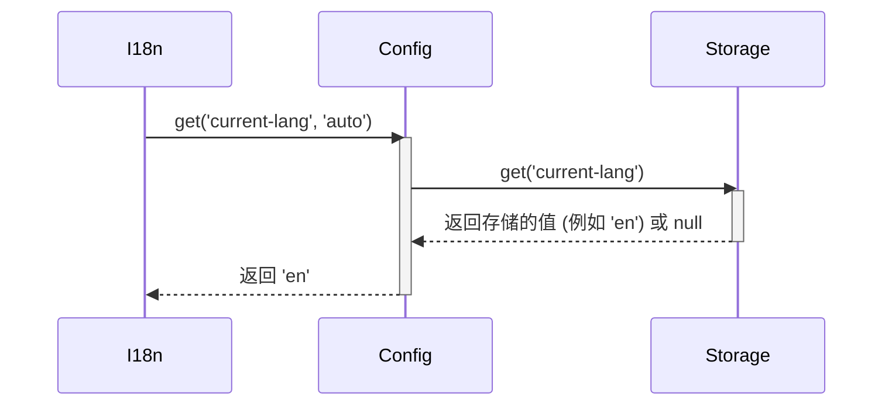

# 配置参数 (Config) 设计文档

本文档遵循 [../GEMINI.MD](../GEMINI.MD) 和 [architect.md](./architect.md) 中的规范。

## 1. 逻辑视图 (Logical View)

### 模块职责

`Config` 模块是整个应用的配置中心。它负责管理所有用户可配置的参数和系统内部的设置。其主要职责包括：

1.  **提供默认值**: 为所有配置项提供一套合理的默认值。
2.  **加载持久化配置**: 在初始化时，通过 `Storage` 模块加载用户之前保存的设置。
3.  **提供统一访问接口**: 为系统其他部分提供 `get` 和 `set` 方法来读写配置项。
4.  **持久化更改**: 当配置项被修改时，通过 `Storage` 模块将更改保存起来。
5.  **支持恢复默认**: 提供一个恢复所有设置为默认值的功能。

### 核心功能

-   `get(key, defaultValue)`: 获取指定键的配置值。如果用户没有设置过，则返回代码中定义的默认值。
-   `set(key, value)`: 设置一个配置项的值，并立即将其持久化。
-   `getAll()`: 获取所有配置项。
-   `restoreDefaults()`: 将所有配置项重置为默认值，并清除持久化存储中的用户设置。

### 依赖关系

`Config` 模块强依赖于 `Storage` 模块来完成配置的读取和存储。



## 2. 过程视图 (Process View)

`Config` 模块通常在应用启动时被初始化。初始化过程中，它会尝试从 `Storage` 加载用户配置，并与默认配置合并。在运行时，其他模块可以随时从 `Config` 实例中读取配置。

### 交互示例：国际化模块获取当前语言



## 3. 开发视图 (Development View)

### 文件结构

-   `src/config.js`: `Config` 模块的源代码。
-   `tests/config.test.js`: `Config` 模块的单元测试。

### API 定义

```javascript
/**
 * @description 管理应用的配置参数。
 * @param {object} args - 构造函数参数。
 * @param {Storage} args.storage - Storage 实例。
 */
function Config(args) {
    this.storage = args.storage;
    let defaultConfig = { /* ... */ };
    let userConfig = {};

    /**
     * @description 初始化，加载用户配置。
     */
    this.init = function() { /* ... */ };

    /**
     * @description 获取配置项。
     * @param {string} key - 键名。
     * @param {*} [defaultValue] - 覆盖默认值的默认值。
     * @returns {*} - 配置值。
     */
    this.get = function(key, defaultValue) { /* ... */ };

    /**
     * @description 设置配置项并持久化。
     * @param {string} key - 键名。
     * @param {*} value - 配置值。
     */
    this.set = function(key, value) { /* ... */ };

    /**
     * @description 恢复默认配置。
     */
    this.restoreDefaults = function() { /* ... */ };
}
```

## 4. 物理视图 (Physical View)

`Config` 模块作为项目的一部分，被 Webpack 捆绑到最终的 `multi-ai-sync-chat.user.js` 文件中。它在每个需要访问配置的上下文（原生页面和主窗口）中都应该被实例化。

## +1. 场景视图 (Scenarios)

### 场景：用户在设置中更改布局模式

1.  用户在主窗口的 UI 上点击按钮，选择“4列”布局。
2.  `MainWindowController` 捕获到该事件。
3.  `MainWindowController` 调用 `config.set('layout', 4)`。
4.  `Config` 模块接收到请求，更新内存中的配置状态，并立即调用 `storage.set('layout', 4)` 将新值持久化。
5.  `MainWindowController` 根据新的配置值，重新渲染其内容区域的布局。
6.  用户刷新主窗口页面后，`MainWindowController` 在初始化时会通过 `config.get('layout')` 获取到之前保存的 `4`，并直接以“4列”布局启动，而不是默认布局。


## **测试用例设计**

本模块的测试用例列表如下：

1. 从配置中读取不存在的key值`a.b`，调用`config.get('a.b')`，返回null
2. 从配置中读取不存在的key值`a.b`，并设置默认值为数字`1`，调用`config.get('a.b',1)`，调用返回 `1` 。
3. 设置key值`a.b`对应的值为100，调用`config.get('a.b',1)`，调用返回 `100` 。然后继续设置`a.b`对应的值为`test`，调用返回`test`。

## 附录

无附录
