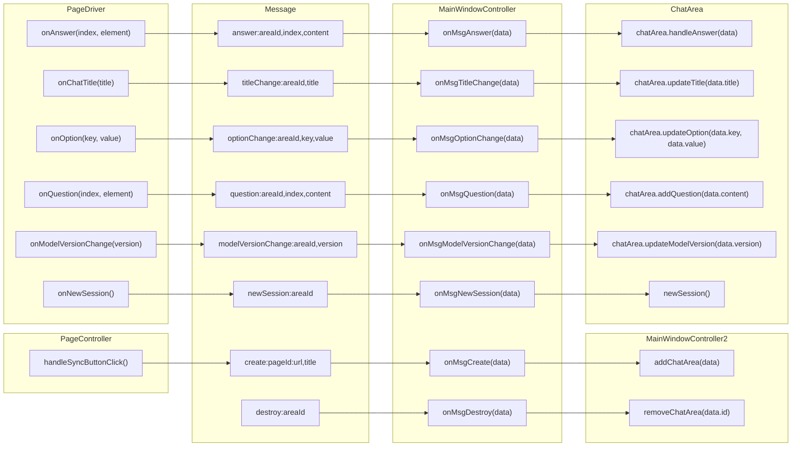
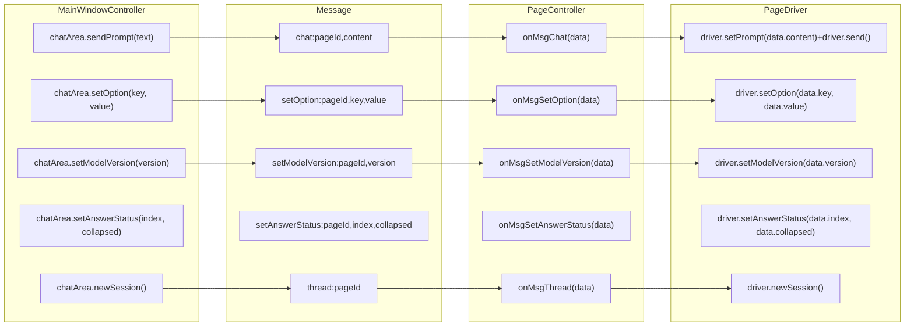
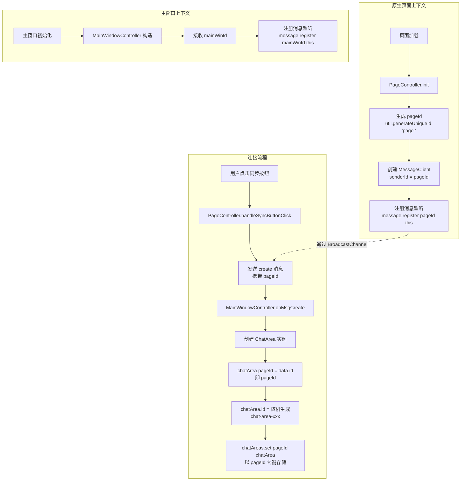
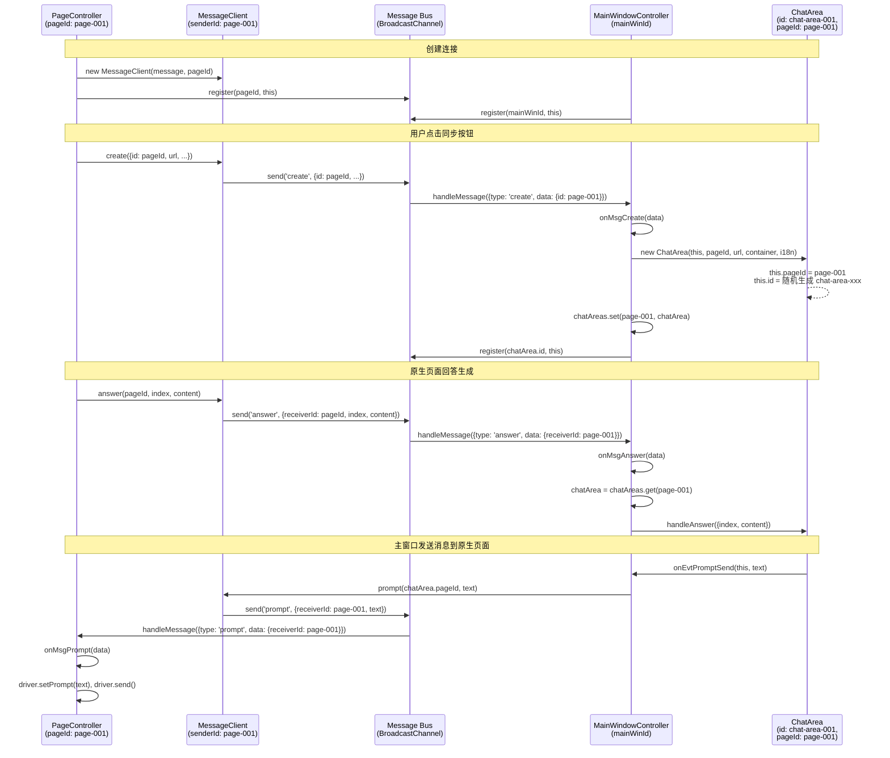
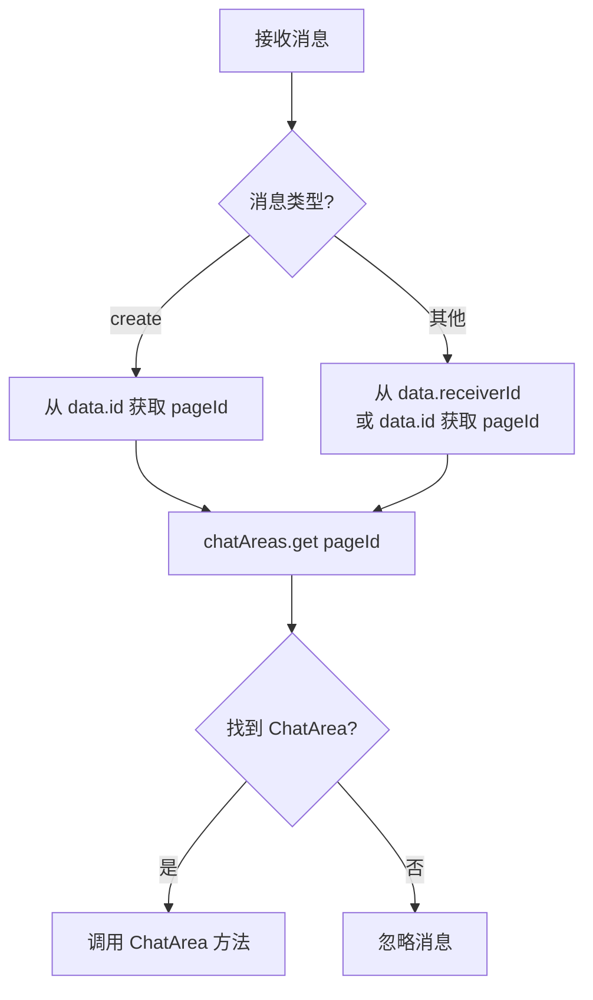

# 事件与消息流设计

本文档概述了关键组件：`PageDriver`、`PageController`、`MainWindowController` 和 `ChatArea` 之间的事件和消息通信流。它详细说明了生成的事件、传输的消息、它们的结构以及订阅关系。

## 1. 组件概述

*   **`PageDriver`**：直接与原生 AI 聊天页面的 DOM 交互。根据用户操作或页面变化生成事件。
*   **`PageController`**：在原生 AI 聊天页面上运行。订阅 `PageDriver` 事件，将其转换为标准化消息，并通过 `Message` 总线发送给 `MainWindowController`。它还接收来自 `MainWindowController` 的消息，并将其转换为 `PageDriver` API 调用。
*   **`MainWindowController`**：在主用户脚本窗口中运行。订阅来自 `PageController` 实例的消息，将其转换为 `ChatArea` API 调用。它还接收来自主窗口 UI 的用户输入，并向 `PageController` 实例发送消息。
*   **`ChatArea`**：代表 `MainWindowController` UI 中的单个 AI 聊天实例。接收来自 `MainWindowController` 的 API 调用以更新其状态和显示。ChatArea是界面组件，不直接通过事件和外部沟通。

## 2. 消息总线 (`Message` 工具)

`Message` 工具充当组件间通信的中央事件总线，尤其是在不同的浏览器上下文（原生 AI 页面和主用户脚本窗口）之间。

### 消息结构

通过 `Message` 总线发送的所有消息都遵循以下结构：

```javascript
{
    type: string, // 消息类型（例如：'create', 'answer', 'chat'）
    payload: object // 与消息关联的数据
}
```

### 常用 Payload 字段

*   标识字段，`string`，用于定位特定实例。
    - `pageId`:`string`，`PageController` 实例的唯一标识符。
    - `areaId`:`string`，`ChatArea` 实例的唯一标识符。
*   `senderId`，发送方的实例唯一标识，必须字段
*   `receiverId`，接收方的实例唯一标识，广播时候为`null`。
*   `url`：`string` - 原生 AI 页面的 URL。
*   `title`：`string` - 聊天会话的标题。
*   `content`：`string` - 文本内容（例如：问题、答案）。
*   `index`：`number` - 特定问题或答案的索引。
*   `key`：`string` - 选项或参数的键。
*   `value`：`any` - 选项或参数的值。
*   `version`：`string` - 模型版本字符串。
*   `collapsed`：`boolean` - 答案的状态（折叠/展开）。

## 3. 事件与消息流

### 3.1. `PageDriver` -> `PageController` -> `MainWindowController`

`PageDriver` 生成事件（通过回调），`PageController` 订阅这些事件。然后 `PageController` 将这些事件转换为消息并发送给 `MainWindowController`。



### 3.2. `MainWindowController` -> `PageController`

`MainWindowController` 接收用户输入或内部事件，并向特定的 `PageController` 实例发送消息。然后 `PageController` 将这些消息转换为 `PageDriver` API 调用。




## 4. `ChatArea` 内部选择模式状态变化

`ChatArea` 组件管理其自身的 UI 状态，包括模型和参数的选择模式。

### 4.1. 模型选择

*   **状态**：当前选定的 AI 模型提供商（例如：“Kimi”、“Gemini”、“ChatGPT”）。
*   **UI 元素**：`model-selector` 下拉菜单，`model-name` 显示。
*   **交互**：
    *   用户点击 `model-name`：切换 `model-dropdown` 的可见性。
    *   用户点击 `model-dropdown` 中的 `model-option`：
        *   更新 `model-name` 显示。
        *   触发 `onEvtProviderChanged` 事件（由 `MainWindowController` 处理）。
        *   如果 `ChatArea` 处于“强制选择”模式（最初没有 URL），它会移除覆盖层并根据新的提供商设置其 `url`。

### 4.2. 参数选择

*   **状态**：各种参数，如“网页访问”、“长思考”、“模型版本”。
*   **UI 元素**：`params-selector` 下拉菜单，`params-button` 触发器。
*   **交互**：
    *   用户点击 `params-button`：切换 `params-dropdown` 的可见性。
    *   用户更改复选框（`web-access`、`long-thought`）：
        *   触发 `onEvtParamChanged` 事件（由 `MainWindowController` 处理）。
    *   用户更改 `select` 元素（`model-version`）：
        *   触发 `onEvtParamChanged` 事件（由 `MainWindowController` 处理）。

### 4.3. 固定状态

*   **状态**：`ChatArea` 是否“固定”。固定的聊天区域在布局中具有优先权。
*   **UI 元素**：`pin-button`。
*   **交互**：
    *   用户点击 `pin-button`：切换 `pinned` 状态。
    *   更新 `pin-button` 的视觉状态（例如，添加/移除 `pinned` 类）。
    *   通知 `MainWindowController` 更新 `updateLayout` 以反映新的固定顺序。

### 4.4. 输入区域状态

*   **状态**：提示输入区域的可见性和停靠状态。
*   **UI 元素**：`input-placeholder`、`chat-area-input`、`textarea`。
*   **交互**：
    *   鼠标进入 `input-placeholder` 或 `chat-area-input`：调用 `showInput()`，使输入区域可见。
    *   `textarea` 获得焦点：调用 `dockInput()`，使输入区域可见并“停靠”（例如，扩展其高度并调整对话区域填充）。
    *   鼠标离开 `chat-area-input` 或 `textarea` 失去焦点：调用 `undockInput()`，它会启动一个计时器，如果焦点不在其中，则隐藏/取消停靠输入区域。

本文档全面概述了 Multi AI Chat Userscript 中的通信和状态管理。

---

## 5. 标识符 (ID) 数据流设计

### 5.1. 核心标识符定义

系统中有三种关键标识符，用于在不同组件之间建立关联：

| 标识符 | 生成位置 | 格式 | 用途 |
|--------|----------|------|------|
| `pageId` | `PageController` 构造函数 | `page-{timestamp}-{counter}-{random}` | 唯一标识一个原生页面实例 |
| `chatArea.id` | `ChatArea` 构造函数 | `chat-area-{timestamp}-{counter}-{random}` | 唯一标识一个聊天区域实例 |
| `mainWinId` | `main-window-initializer.js` 传入 | 自定义（通常为 `main-window`） | 主窗口的接收者 ID |

### 5.2. ID 在组件中的沉淀

```javascript
// PageController (src/page-controller.js:18)
this.pageId = this.util.generateUniqueId('page-');

// ChatArea (src/chat-area.js:33)
this.pageId = pageId;           // 关联的页面 ID
this.id = this.utils.generateUniqueId('chat-area-');  // 自己的唯一 ID

// MainWindowController (src/main-window-controller.js:23)
this.chatAreas = new Map();     // key: pageId, value: ChatArea
```

### 5.3. ID 生成流程图



### 5.4. 消息路由顺序图



### 5.5. 消息中的 ID 携带规则

#### 5.5.1. 点对点消息 (包含 receiverId)

当需要将消息发送给特定接收者时，消息中携带 `receiverId` 字段：

```javascript
// MessageClient 发送示例
msgClient.prompt(receiverId, text) {
    this.message.send('prompt', {
        receiverId: receiverId,  // 目标 pageId
        text: text,
        senderId: this.senderId  // 发送者 pageId
    });
}
```

#### 5.5.2. 广播消息 (无 receiverId)

当消息需要广播给所有监听者时，不携带 `receiverId` 字段：

```javascript
// 广播示例
msgClient.chat(prompt) {
    this.message.send('chat', {
        prompt: prompt,
        senderId: this.senderId
    });
}
```

#### 5.5.3. create 消息 (特殊)

`create` 消息是唯一使用 `id` 字段而非 `receiverId` 字段的消息类型：

```javascript
// PageController -> MainWindowController
this.msgClient.create({
    id: this.pageId,              // 原生页面的 pageId
    url: window.location.href,
    providerName: this.driver.getProviderName(),
    title: this.driver.getChatTitle(),
    params: {...},
    conversation: [...]
});
```

### 5.6. ID 查找流程

当 `MainWindowController` 收到消息时，通过以下步骤定位目标 `ChatArea`：



### 5.7. 数据结构总结

| 组件 | 持有的 ID 相关属性 | 用途 |
|------|-------------------|------|
| `PageController` | `pageId` | 消息发送者标识、消息注册 receiverId |
| `ChatArea` | `id` (chat-area-xxx) | 事件处理上下文传递 |
| `ChatArea` | `pageId` | 与原生页面的关联，用于消息路由 |
| `MainWindowController` | `mainWinId` | 主窗口接收消息的标识 |
| `MainWindowController` | `chatAreas: Map<pageId, ChatArea>` | 通过 pageId 快速查找 ChatArea |
| `MessageClient` | `senderId` | 每次发送消息时携带的发送者标识 |

### 5.8. 代码中的关键位置

| 文件 | 行号 | 说明 |
|------|------|------|
| `src/page-controller.js` | 18 | `pageId` 生成 |
| `src/page-controller.js` | 21 | `MessageClient` 创建，传入 `pageId` 作为 `senderId` |
| `src/page-controller.js` | 31 | 消息注册，使用 `pageId` 作为 `receiverId` |
| `src/chat-area.js` | 31 | `pageId` 属性赋值（关联页面） |
| `src/chat-area.js` | 33 | `id` 属性赋值（自己生成） |
| `src/main-window-controller.js` | 23 | `chatAreas` Map 声明 |
| `src/main-window-controller.js` | 480 | `chatAreas.set(data.id, chatArea)` 使用 `pageId` 作为 key |
| `src/main-window-controller.js` | 352 | `chatAreas.get(data.id)` 使用 `pageId` 查找 |

### 5.9. 设计说明

1. **pageId 作为唯一关联键**：系统设计上使用 `pageId` 作为原生页面和 ChatArea 之间的唯一关联键。`chatArea.id` 主要用于内部事件处理和调试。

2. **消息路由机制**：
   - `Message` 总线通过 `receiverId` 字段实现点对点消息路由
   - 如果没有 `receiverId`，消息会广播给所有注册的监听者
   - 每个组件通过 `message.register(receiverId, listener)` 注册自己的监听器

3. **ID 生成时机**：
   - `pageId` 在 `PageController` 构造时立即生成
   - `chatArea.id` 在 `ChatArea` 构造时立即生成
   - 两者都使用 `util.generateUniqueId()` 确保全局唯一性

4. **数据一致性保证**：
   - `chatAreas` Map 始终使用 `pageId` 作为键
   - 所有从原生页面发送到主窗口的消息都携带 `pageId`（通过 `id` 或 `receiverId` 字段）
   - `ChatArea` 内部持有 `pageId` 用于反向查找和消息发送