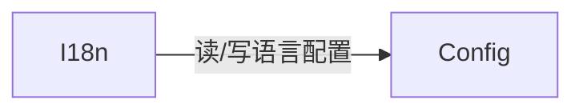
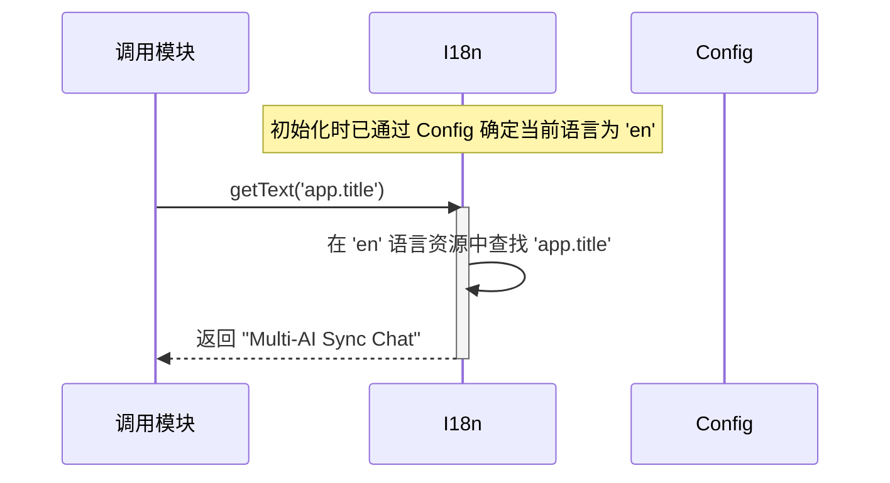

# 国际化 (I18n) 设计文档

本文档遵循 [../GEMINI.MD](../GEMINI.MD) 和 [architect.md](./architect.md) 中的规范。

## 1. 逻辑视图 (Logical View)

### 模块职责

`I18n` 模块是项目的国际化中心，负责管理所有用户界面（UI）的显示文本。其核心职责是：

1.  **文本资源管理**: 存储一个包含多种语言（如中文、英文）文本的字典。所有需要在 UI 上显示的字符串都必须通过此模块获取。
2.  **语言检测与切换**: 负责确定当前应该使用的语言。它会按照 “用户在配置中设置的语言 > 浏览器自身的语言设置 > 默认语言（如中文）” 的优先级顺序来选择语言。
3.  **提供统一接口**: 提供一个简单的 `getText(key)` 方法，让其他模块可以通过一个唯一的键（如 `'layout.switch.2_columns'`）来获取当前语言对应的文本。

### 核心功能

-   `getText(key)`: 根据给定的键和当前确定的语言，返回相应的文本字符串。
-   `getCurrentLang()`: 获取当前正在使用的语言代码（如 `zh-CN`, `en`）。
-   `setCurrentLang(lang)`: 设置新的语言，并通知 `Config` 模块将其持久化。
-   `getBrowserLang()`: 获取浏览器的语言设置。

### 依赖关系

`I18n` 模块依赖于 `Config` 模块来读取和存储用户选择的语言偏好。另外，`I18n`本身不包含任何语言资源，所有的语言资源都在创建`I18n`对象的时候提供给构造函数。



## 2. 过程视图 (Process View)

`I18n` 模块在应用启动时初始化。在初始化阶段，它会通过 `Config` 模块获取用户配置的语言，并结合浏览器语言，确定最终要使用的语言。

### 交互示例：获取文本



## 3. 开发视图 (Development View)

### 文件结构

-   `src/i18n.js`: `I18n` 模块的源代码，包含所有语言的文本资源。
-   `tests/i18n.test.js`: `I18n` 模块的单元测试。

### API 定义

```javascript
/**
 * @description 管理国际化文本资源。
 * @param {object} resources - 语言资源，包含所有语言的文本。
 * @param {Config} config - Config 实例，包含各种配置信息。
 */
function I18n(resources, config) {
    this.config = config;
    this.currentLang = 'zh-CN';
    this.resources = resources;

    /**
     * @description 初始化，确定当前语言。
     */
    this.init = function() { /* ... */ };

    /**
     * @description 根据键获取当前语言的文本。
     * @param {string} key - 文本的键。
     * @returns {string} - 对应的文本。
     */
    this.getText = function(key) { /* ... */ };

    /**
     * @description 设置当前语言。
     * @param {string} lang - 语言代码 (e.g., 'en')。
     */
    this.setCurrentLang = function(lang) { /* ... */ };
}
```

### 文本资源结构

`resources` 对象结构清晰，便于维护和添加新语言。

```javascript
this.resources = {
    'zh-CN': {
        'app.title': '多AI同步聊天',
        'button.send': '发送'
    },
    'en': {
        'app.title': 'Multi-AI Sync Chat',
        'button.send': 'Send'
    },
    'ar': {
        'app.title': 'دردشة متزامنة متعددة الذكاء الاصطناعي',
        'button.send': 'إرسال'
    }
};
```

## 4. 物理视图 (Physical View)

`I18n` 模块的代码和文本资源被 Webpack 捆绑到最终的 `multi-ai-sync-chat.user.js` 文件中。它在每个需要显示 UI 文本的上下文（原生页面和主窗口）中都应该被实例化。

## +1. 场景视图 (Scenarios)

### 场景：用户切换界面语言

1.  用户在主窗口顶部的语言切换菜单中选择了“English”。
2.  `MainWindowController` 捕获到该点击事件。
3.  `MainWindowController` 调用 `i18n.setCurrentLang('en')`。
4.  `I18n` 模块将内部的 `currentLang` 属性更新为 `'en'`。
5.  同时，它调用 `config.set('current-lang', 'en')`，将用户的偏好持久化。
6.  `MainWindowController` 随后需要触发一次 UI 的全面刷新，或者所有持有 `I18n` 实例的模块在下次获取文本时，都会自动通过 `i18n.getText()` 方法取到英文文本，从而实现界面的动态切换。


## **测试用例设计**

本模块的测试用例列表如下：

1. 将浏览器默认语言设置为`en`，创建I18n实例之后，调用 `getCurrentLang`应该返回`en`。
2. 将浏览器默认语言设置为`en`，但是`Config`中的的当前语言设置为`zh-CN`，创建I18n实例之后，调用 `getCurrentLang`应该返回`zh-CN`。
3. 将浏览器默认语言设置为`zh-CN`，多语言key值`a.b`无对应文字，调用`getText("a.b")`之后返回key值`a.b`。
4. 接上例条件，设置`a.b`对应英文为`test`。在当前语言设置为`en`的时候，返回test，设置为`en-US`的时候也返回test，设置为zh-CN的时候也要返回test
5. 接上例条件，保留英文设置，继续设置`a.b`对应中文`zh`为“测试”。在当前语言设置为`en`的时候，返回test，设置为`en-US`的时候也返回test，设置为zh-CN的时候也要返回“测试”，设置为`zh-TW`的时候返回“测试”
6. 接上例条件，保留英文设置，设置`a.b`不再对应`zh`，对应简体中文`zh-CN`为“测试cn”，对应繁体中文`zh-TW`为“测试tw”，在两种中文设置下要返回正确语言，但是如果设置为新加坡的中文或香港中文，则要返回默认的英文test。

## 附录

无附录