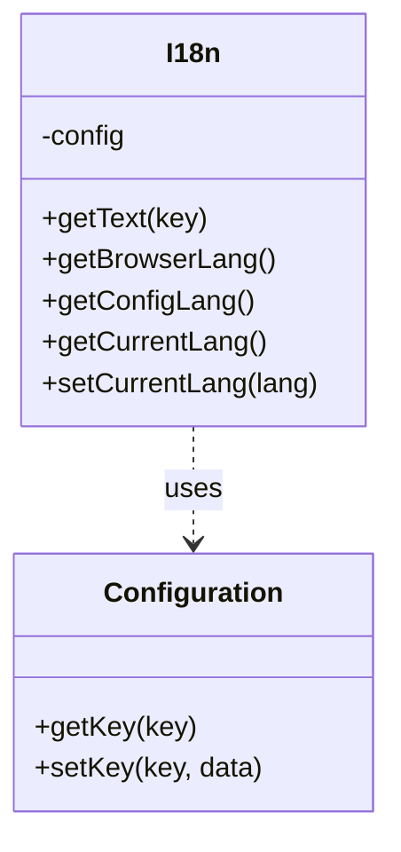
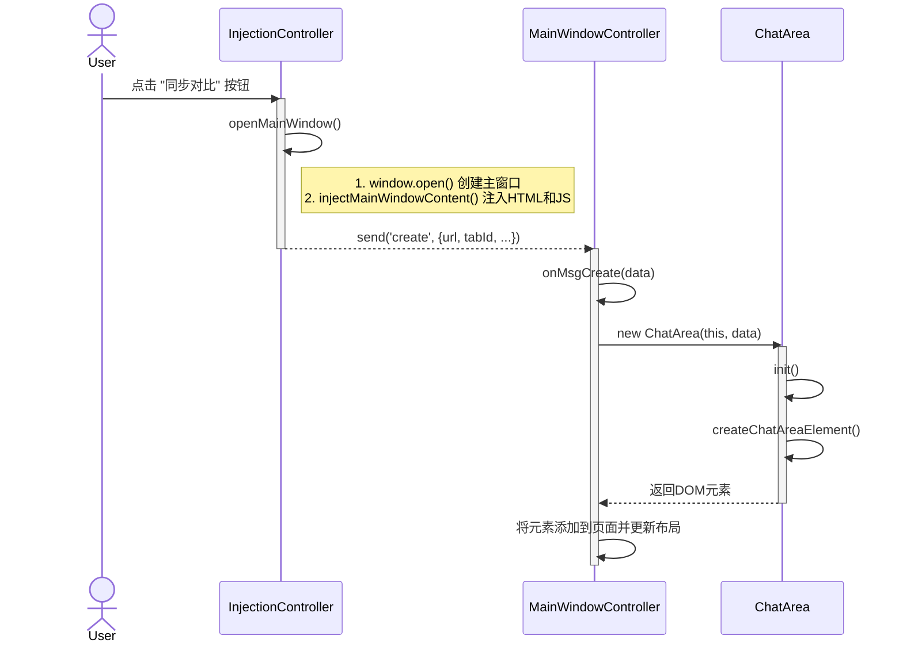
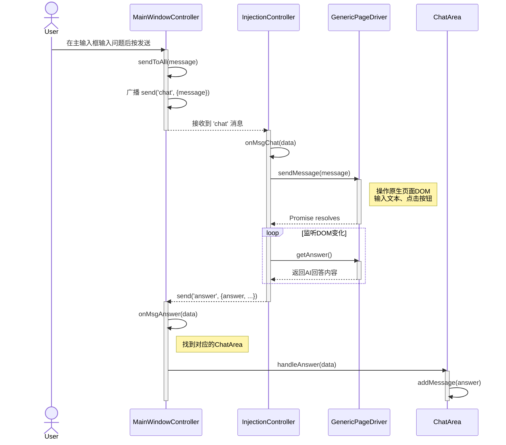

# 国际化功能设计文档

本文档使用4+1视图模型来描述国际化的架构。本文档的设计受到 [./architech.md]总体架构设计的制约，除非明确指定可以超越总体架构。

## 功能简述

国际化`I18n` 负责包含项目所有的国际化文字信息，并且支持自动检测当前浏览器的语言设置，以及配置文件中的语言设置。

## 设计

### 1. 逻辑视图 (Logical View)

逻辑视图关注系统的功能和结构，展示了主要的类、它们的职责以及它们之间的关系。

#### 核心类及其职责

- **`I18n`**: 负责管理所有显示文字的所有语言内容，其成员定义如下：
  - getText(key): 负责通过key获取对应语言的文字，返回字符串
  - getBrowserLang(): 负责获取浏览器当前的语言设置，返回语言名称
  - getConfigLang(): 负责获取配置文件中设置的语言，返回语言名称
  - getCurrentLang(): 负责返回当前有效的语言，配置文件优先，浏览器其次。
  - setCurrentLang(lang): 设置当前有效语言，内容以`key`值`current-lang`保存在配置文件中

#### 核心类的依赖情况

- **`I18n`**的依赖
  - **`Configuration`**: 从配置文件中读取各种配置参数

#### 类图 (Class Diagram)

### 2. 进程视图 (Process View)

进程视图关注系统的运行时行为，特别是并发和通信。

本模块涉及两个类的交互：

1. **I18n**: 共享的多语言类，页面范围内的单例`singleton`。
2. **Configuration**: 共享的配置类，页面范围内的单例`singleton`。

其中`I18n`通过构造函数关联 `Configuration`。

#### 场景1: 创建I18n公共实例

下面的顺序图展示了用户首次在AI页面点击“同步对比”按钮时的交互流程。

#### 场景2: 从I18n返回key对应的语言

下面的顺序图展示了用户在主窗口的全局输入框中提问，然后各个AI页面响应并返回答案的流程。

#### I18n的 状态图

该类为无状态

### 3. 开发视图 (Development View)

开发视图描述了代码的组织结构。源代码位于 `src` 目录下，结构清晰，职责分明。

- `i18n.js`: **国际化库**。存储多语言文本资源。

### 4. 物理视图 (Physical View)

物理视图描述了软件如何部署和运行。

- **部署单元**: 整个项目通过 `webpack` 打包成一个单一的 `.user.js` 文件。
- **部署环境**: 这个 `.user.js` 文件被安装到用户浏览器的油猴脚本管理器扩展中（如 Tampermonkey, Greasemonkey）。
- **运行时**:
    1. 当用户访问在 `userscript.meta.js` 中 `@match` 规则定义的一个AI网站时，脚本管理器会将该 `.user.js` 注入到该页面，创建一个 `InjectionController` 实例。
    2. 当用户点击“同步对比”按钮时，`InjectionController` 会动态创建一个新的浏览器窗口/Tab（主窗口），并通过 `document.write` 将主窗口的完整HTML和JS（包括 `MainWindowController` 等类的源码）写入其中，从而启动第二个运行时环境。

### +1. 场景视图 (Scenarios)

场景视图通过关键用例将以上四个视图联系起来。核心场景已在 **进程视图** 的顺序图中详细描述：

1. **首次同步**: 用户在任意一个受支持的AI网站上，点击“同步对比”按钮，脚本会自动打开一个主窗口，并在其中为该AI创建一个对话面板。
2. **多路提问**: 用户在主窗口底部的通用输入框中输入一个问题并发送，该问题会被同时发送到所有已打开的对话面板对应的原生AI网站。
3. **汇总答案**: 每个AI网站生成答案后，原生页面中的脚本会捕获到新内容，并将其发送回主窗口，主窗口在对应的对话面板中渲染出该答案。

这种设计实现了核心目标：将多个独立的AI会话聚合到一个统一的界面中进行同步交互和对比。

## 研究工作

## 测试用例设计

## 附录
