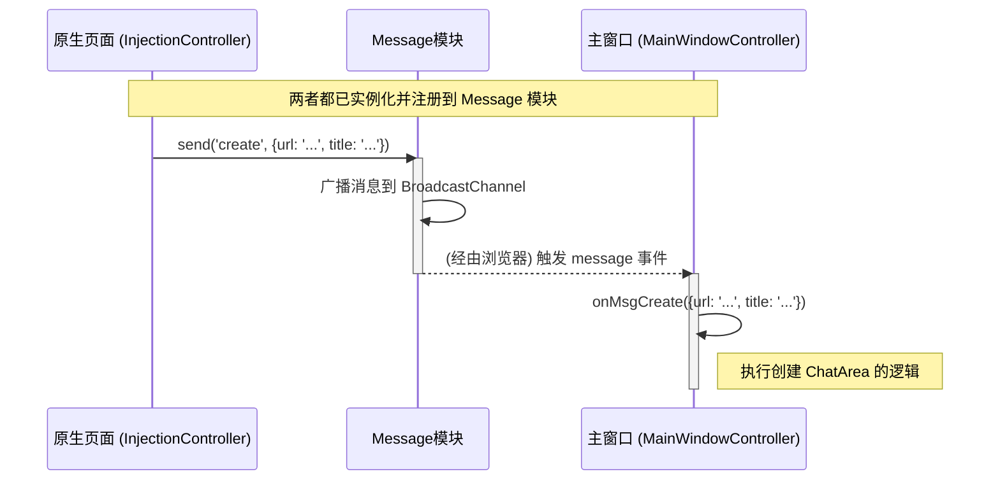

# 消息通讯 (Message) 设计文档

本文档遵循 [../GEMINI.MD](../GEMINI.MD) 和 [architect.md](./architect.md) 中的规范。

## 1. 逻辑视图 (Logical View)

### 模块职责

`Message` 模块是整个系统的神经中枢，负责实现原生 AI 页面和主窗口之间的跨窗口、跨 Tab 通信。它的核心职责是：

1.  **封装通信技术**: 抽象并封装底层的 `BroadcastChannel` API，为上层模块提供一个更简单、更高级的发布/订阅（Pub/Sub）接口。
2.  **实现消息路由**: 确保从一个上下文发送的消息能被所有其他相关上下文接收到。
3.  **约定优于配置**: 提供一种机制，能够自动发现和注册消息处理器，简化模块间的集成。在本项目中，约定所有命名为 `onMsg<MessageType>` 的方法都将被自动注册为消息监听器。

### 核心功能

-   `send(type, data)`: 向通信频道广播一个指定类型的消息，并附带数据。
-   `register(receiverId, listener)`: 注册一个对象作为消息监听器。该方法会检查 `listener` 对象的所有属性，将所有符合 `onMsg*` 命名约定的方法注册为对应消息类型的处理器。
-   `unregister(receiverId)`: 从消息监听器中移除一个对象。

### 消息定义

一个完整的消息包含如下内容：

* 消息类型：这个体现在`send`函数的`type`参数
* 消息的发送者：可选，一般会放在`send`函数的`data.senderId`参数中，如果缺失一般表示无需对话和回复的消息。
* 消息的接收者：可选，一般会放在`send`函数的`data.receiverId`参数，如果缺失表示广播消息，会发送给所有的接收者。
* 消息的附加数据：可选，一般会放在`send`函数的`data`参数的其他字段中，由消息的接收者解释和处理。

### 消息接收者的注册逻辑

消息对象创建之后，就可以接收响应各种消息了，外部消息的接收者如果要正确接收到消息，需要把自己注册到`Message`中，注册逻辑如下：

1. 消息接收者调用`register(receiverId, listener)`注册消息监听器，这个消息监听器一般是接收者自己，也不排除是专门创建的接收对象。
2. `Message`对象扫描注册的`listener`的成员，找到一个`onMsg`开头的函数，并将这些函数提取，结合`type`消息类型、`receiverId`一并保留注册
3. `Message`对象继续扫描，直到扫描完成，则该次注册完成

### 消息的接收逻辑

消息对象在收到一个消息之后，按照如下逻辑寻找消息的接收者：

1. 先判断消息的`type`，然后提取消息的`receiverId`匹配的所有注册信息，把对应的接收函数找到
2. 循环调用这些接收函数，把消息的`data`数据传递给它处理

## 2. 过程视图 (Process View)

`Message` 模块是实现系统核心业务流程（如内容同步）的关键。所有跨窗口的交互都必须通过此模块进行。

### 交互示例：原生页面通知主窗口创建内容块



## 3. 开发视图 (Development View)

### 文件结构

-   `src/message.js`: `Message` 模块的源代码。
-   `tests/message.test.js`: `Message` 模块的单元测试。

### API 定义

```javascript
/**
 * @description 封装 BroadcastChannel 实现跨窗口通信。
 * @param {string} channelName - 通信频道的名称。
 */
function Message(channelName) {
    this.channel = new BroadcastChannel(channelName);
    this.listeners = new Map(); // 使用type和receiverId两级的树状结构

    /**
     * @description 广播消息。
     * @param {string} type - 消息类型 (e.g., 'chat', 'create')。
     * @param {object} data - 附带的数据。
     */
    this.send = function(type, data) { /* ... */ };

    /**
     * @description 注册一个监听器对象。
     * @param {string} receiverId - 对象的接收id。
     * @param {object} listener - 包含 onMsg* 方法的对象。
     */
    this.register = function(receiverId, listener) { /* ... */ };

    /**
     * @description 注销一个监听器对象。
     * @param {string|object} target - receiverId或者listener对象
     */
    this.unregister = function(target) { /* ... */ };
}
```

## 4. 物理视图 (Physical View)

`Message` 模块被 Webpack 捆绑到最终的 `multi-ai-sync-chat.user.js` 文件中。它在每个需要通信的上下文（原生页面和主窗口）中都必须被实例化，并且 **必须使用相同的 `channelName`** (`multi-ai-sync-chat-channel`) 来确保它们在同一个通信频道上。

## +1. 场景视图 (Scenarios)

### 场景：主窗口向所有原生页面广播一个聊天消息

1.  用户在主窗口的全局输入框中输入问题，点击“发送”。
2.  `MainWindowController` 捕获到该事件。
3.  `MainWindowController` 调用 `message.send('chat', { content: '你好世界' })`。
4.  `Message` 模块将 `{ type: 'chat', data: { content: '你好世界' } }` 对象通过 `BroadcastChannel` 发送出去。
5.  所有打开的原生 AI 页面中运行的 `Message` 实例都会收到这个消息。
6.  每个 `Message` 实例会查找其注册的监听器（即 `InjectionController` 实例）。
7.  它发现 `InjectionController` 有一个名为 `onMsgChat` 的方法，于是调用 `injectionController.onMsgChat({ content: '你好世界' })`。
8.  `InjectionController` 随后调用其内部的 `PageDriver` 将消息发送到对应的 AI 聊天界面中。

## **研究工作**

本模块比较简单，无特别研究工作

## **测试用例设计**

本模块的测试用例列表如下：

1. 在没有任何订阅的情况下，通过`Message`对象发送消息，应该报告成功
2. 通过`Message`对象向有一个订阅者的通道发送一个消息，订阅者应该收到一个消息。发送10个消息则应该收到10个消息
3. 通过`Message`对象向有两个订阅者的通道发送一个消息，两个订阅者应该都可以收到一个消息，继续发送10个消息，两个订阅者会再收到10个消息
4. 订阅者有两个onMsg开头的`method`，通过通过`Message`对象发送两种不同的消息，两个`method`都应该收到各自对应的消息内容

## 附录

无附录


