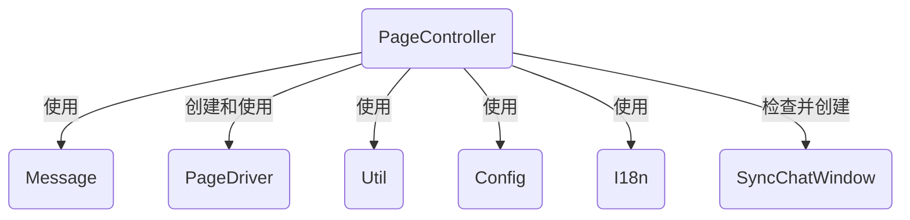
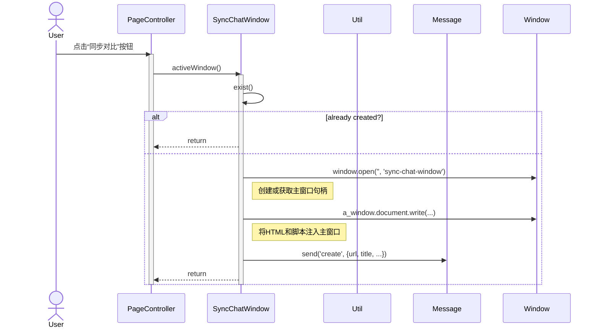
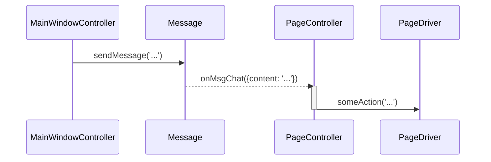

# 原生页面控制器 (PageController) 设计文档

本文档遵循 [../GEMINI.MD](../GEMINI.MD) 和 [architect.md](./architect.md) 中的规范。

在生成代码的时候，可以参考[../research/page-controller.html]()中的研究成果代码。

## 1. 逻辑视图 (Logical View)

### 模块职责

`PageController` 是运行在原生 AI 聊天页面中的核心协调器。它是该页面所有功能的入口点，负责将 `Message` 模块、`PageDriver` 模块和用户界面（“同步对比”按钮）连接在一起。其主要职责是：

1.  **UI 注入**: 在页面上渲染“同步对比”按钮，为用户提供发起同步操作的入口。在页面中为交谈问答内容区增加全部展开、全部折叠以及对话索引（垂直灯笼形状的数字序号，从1开始），可以点击索引序号快速跳到回答位置（如果回答被折叠要自动展开），悬浮在索引序号上可以显示相应问题内容。为每个回答内容增加鼠标悬停时候显示的折叠和展开悬浮工具条（显示在区域外侧中间上方）。
2.  **驱动管理**: 根据当前页面的 URL，选择、实例化并管理一个合适的 `PageDriver` 实例。
3.  **主窗口管理**: 负责创建或激活主窗口 (`sync-chat-window`)，并在主窗口加载后向其发送创建内容块的初始消息。
4.  **消息中继**: 作为原生页面和主窗口之间的消息网关。它监听来自主窗口的指令（如 `chat`），并将其传递给 `PageDriver` 执行；同时，它也监听 `PageDriver` 检测到的页面变化（如新答案），并将其打包成消息发送回主窗口。

### 核心类与依赖

-   **`PageController`**: 核心类，聚合了其他模块的功能。
-   **依赖关系**:
    -   `Message`: 用于与主窗口进行双向通信。
    -   `PageDriver`: 用于与当前 AI 页面的 DOM 进行交互。
    -   `Util`: 用于 DOM 操作和 UI 创建。
    -   `Config`: 用于获取配置信息（例如，是否自动打开主窗口）。
    -   `I18n`: 用于显示国际化的 UI 文本。
    -   `SyncChatWindow`：负责检查和创建主窗口实例。



## 2. 过程视图 (Process View)

`PageController` 在油猴脚本注入原生页面后立即初始化。

### 交互示例：首次点击“同步对比”



### 交互示例：接收主窗口的聊天指令



## 3. 开发视图 (Development View)

### 文件结构

-   `src/page-controller.js`: `PageController` 模块的源代码。
-   `src/index.js`: 脚本入口，负责实例化 `PageController`。
-   `tests/page-controller.test.js`: `PageController` 模块的单元测试。

### API 定义

```javascript
/**
 * @description 在原生AI页面运行的核心控制器。
 * @param {object} args - 构造函数参数。
 */
function PageController(args) {
    this.message = args.message;
    this.config = args.config;
    // ... 其他依赖

    /**
     * @description 初始化，注入UI，选择驱动。
     */
    this.init = function() { /* ... */ };

    /**
     * @description 处理来自主窗口的聊天消息。
     * @param {object} data - 消息数据。
     */
    this.onMsgChat = function(data) { /* ... */ };

    /**
     * @description 处理来自主窗口的创建新会话的指令。
     * @param {object} data - 消息数据。
     */
    this.onMsgThread = function(data) { /* ... */ };
}
```

## 4. 物理视图 (Physical View)

`PageController` 的代码被捆绑到 `multi-ai-sync-chat.user.js` 中。当用户浏览器匹配 `@match` 规则访问一个 AI 网站时，油猴扩展会注入该脚本，并创建一个 `PageController` 实例。每个被注入的 Tab/窗口都有一个独立的 `PageController` 实例。

## +1. 场景视图 (Scenarios)

### 场景：页面加载和初始化

1.  用户打开 `https://chat.openai.com/`。
2.  Tampermonkey 检测到 URL 匹配，注入 `multi-ai-sync-chat.user.js`。
3.  `index.js` 作为入口点被执行。
4.  `index.js` 创建 `Message`, `Config`, `Storage`, `I18n` 等核心服务的单例。
5.  `index.js` 创建 `PageController` 的实例，并将上述服务作为依赖注入。
6.  `pageController.init()` 被调用。
7.  `init` 方法在页面右上角渲染出“同步对比”按钮，并根据 `window.location.hostname` 选择了 `ChatGPTPageDriver`。
8.  `PageController` 通过 `message.register(this)` 将自己注册为消息监听器，准备接收来自主窗口的指令。


## **测试用例设计**

本模块的测试用例的基础场景是一个假想的大模型窗口，包含研究工作“原生窗口的内容附加”中描述的所有元素。需要为它定制一个PageDriver。另外，大模型的回答需要Mock机制，做成异步回答。

测试用例列表如下，如果用例太大需要可以编码时候切换成更小的用例：

1. 模拟按下同步对比按钮，第一次会创建主窗口，第二次会激活主窗口。
2. 检查内容区是否有全部展开、全部折叠、回答索引，并且都工作正常
3. 检查每个回复内容是否有鼠标悬浮出现的折叠和展开工具条，是否能够正常工作。
4. 界面中输入提示词，并点击提交按钮，在模拟大模型回答之后，结果应该通过Message发出通知消息
5. 修改界面中的大模型的各种配置选项，如长思考、联网模式、切换模型版本，结果应该通过Message发出通知消息
6. 向Message发送获取配置项、设置配置项的消息，页面应该正确设置
7. 向Message发送提示词，页面应该可以正确发送给大模型，然后模拟的大模型回复完毕之后，结果应该通过Message发出通知消息
8. 向Message发出获取历史会话的消息，应该能够收到历史会话列表。

## 附录

无附录
