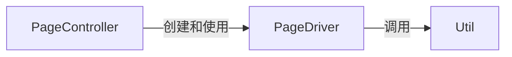
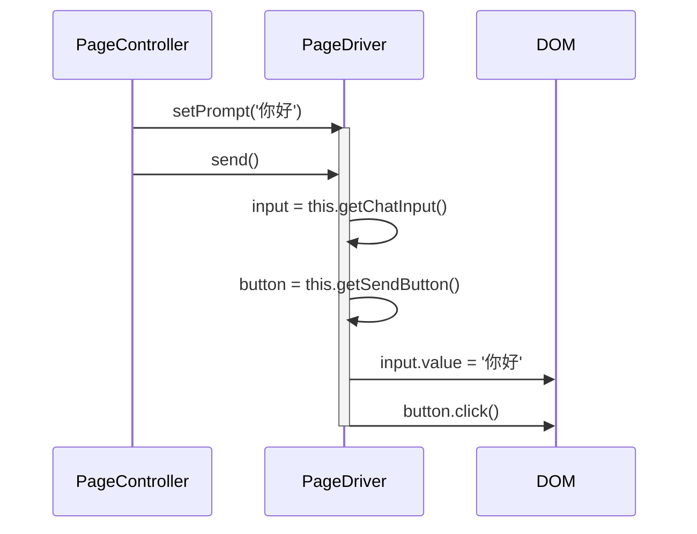

# 原生页面驱动 (PageDriver) 设计文档

本文档遵循 [../GEMINI.MD](../GEMINI.MD) 和 [architect.md](./architect.md) 中的规范。

## 1. 逻辑视图 (Logical View)

### 模块职责

`PageDriver` 是一个 **策略模式** 和 **适配器模式** 的实现，旨在将通用的业务逻辑（如“发送消息”、“获取最新回答”）与特定 AI 网站的 DOM 结构和行为解耦。它的核心职责是：

1.  **定义统一接口**: `GenericPageDriver` 作为抽象基类，定义了所有具体驱动必须遵守的一套标准方法（契约），如 `getConversationCount()`、`send()`、`getQuestion(int index)` 、`getAnswer(int index)` 等。
2.  **封装网站特异性**: 每个具体的驱动（如 `KimiPageDriver`, `GeminiPageDriver`）继承自 `GenericPageDriver`，并提供特定网站的 CSS 选择器和方法实现。这使得核心控制器 `PageController` 无需关心它正在与哪个网站交互。
3.  **提供 DOM 操作**: 封装了在原生 AI 页面上执行具体操作的逻辑，包括会话标题、历史会话区、每一个历史会话项、提示词输入框、提交按钮、联网模式开关、长思考开关、模型版本选择下拉框、上传附件按钮、对话窗口、每个问题内容、每个回复内容的元素定位和内容获取。行动方面包括：在提示词输入框中输入文本、点击发送按钮、上传附件、设置开关、获取和设置模型版本。事件监控包括：新回复内容的完成。

### 核心类

-   **`GenericPageDriver` (抽象基类)**: 定义所有驱动的通用接口和部分默认实现。它本身不能被直接实例化。
-   **`XxxPageDriver` (具体类)**: 例如 `KimiPageDriver`。它为特定网站提供了具体的 CSS 选择器 `selectors` 对象，并可能重写基类的方法以适应网站的独特行为。

### 依赖关系

`PageDriver` 被 `PageController` 创建和使用。它自身可能会使用 `Util` 模块来辅助进行 DOM 操作。



## 2. 过程视图 (Process View)

`PageDriver` 是被动的，它仅响应 `PageController` 的调用。`PageController` 根据当前页面的 URL，从一个驱动映射表中选择并实例化正确的 `PageDriver`。

### 交互示例：发送消息



## 3. 开发视图 (Development View)

### 文件结构

-   `src/page-driver.js`: 包含 `GenericPageDriver` 基类和所有具体的 `SpecificPageDriver` 实现。
-   `tests/page-driver.test.js`: `PageDriver` 模块的单元测试（通常使用模拟的 DOM 环境）。

### API 定义 (`GenericPageDriver`)

```javascript
/**
 * @description 页面驱动的抽象基类。
 */
function GenericPageDriver() {
    /**
     * @description 获取聊天中一问一答对话的数量，该数量就是Question和Answer的数量。
     * @returns {int}
     */
    this.getConversationCount = function() { /* ... */ };

    /**
     * @description 获取聊天区域的问题。
     * @param {int} index - 问题的序号。     
     * @returns {HTMLElement|null}
     */
    this.getQuestion = function(index) { /* ... */ };
  
    /**
     * @description 获取聊天区域的回答内容，如果同一个问题有多个回答内容，则使用最后一个。
     * @param {int} index - 回答的序号。     
     * @returns {HTMLElement|null}
     */
    this.getAnswer = function(index) { /* ... */ };

    /**
     * @description 自动触发发送按钮，把prompt和attachment一并发送出去。
     */
    this.send = function() { /* ... */ };

    /**
     * @description 将消息发送到 AI 聊天界面的提示词文本框。
     * @param {string} message - 要发送的消息文本。
     */
    this.setPrompt = function(message) { /* ... */ };
    
    /**
     * @description 将一个新文件添加到聊天输入框中。
     * @param {Object} file - 要发送的文件。
     */
    this.addAttachment = function(file) { /* ... */ };
   
    /**
     * @description 获取当前会话的标题
     * @returns {string}
     */
    this.getChatTitle = function() { /* ... */ };
  
    /**
     * @description 获取历史聊天中对话的数量。
     * @returns {int}
     */
    this.getHistoryCount = function() { /* ... */ };

    /**
     * @description 获取历史聊天区域的聊天标题和链接。
     * @param {int} index - 历史的序号。     
     * @returns {title: 标题, url: 页面的网址}
     */
    this.getHistory = function(index) { /* ... */ };
  
    /**
     * @description 获取模型的各种开关配置项，包含当前模型版本current-model和模型下拉列表models。    
     * @returns {key: ..., value: ...}
     */
    this.getOptions = function() { /* ... */ };

    /**
     * @description 获取历史聊天区域的聊天标题和链接。
     * @param {string} key - 模型配置的名称。     
     * @param {string} value - 配置项的值。     
     * @returns 
     */
    this.setOption = function(key, value) { /* ... */ };
  
    /**
     * @description 设置回答的折叠状态。
     * @param {int} index - 回答的序号。 
     * @param {boolean} collapsed - 是否折叠状态，true表示折叠，false表示展开。         
     * @returns 
     */
    this.setAnswerStatus = function(index, collapsed) { /* ... */ };

    /**
     * @description 获取回答的折叠状态。
     * @param {int} index - 回答的序号。         
     * @returns {boolean} 折叠状态，true表示折叠，false表示展开。
     */
    this.setAnswerStatus = function(index) { /* ... */ };

    /**
     * @description 在大模型回答的时候通知。
     * @param {int} index - 回答的序号。
     * @param {HTMLElement} div - 回答区域的元素
     * @returns 
     */
    this.onAnswer = function(index, div) { /* ... */ };

     /**
     * @description 在大模型标题被修改的时候发出通知。
     * @param {string} title - 新的会话标题。
     * @returns 
     */
    this.onChatTitle = function(title) { /* ... */ };

    /**
     * @description 在页面的大模型配置参数修改的时候发出通知
     * @param {string} key - 模型配置的名称。     
     * @param {string} value - 配置项的新值。     
     * @returns 
     */
    this.onOption = function(key, value) { /* ... */ };
  
 }
```

### 扩展新网站

添加对新网站（如 `claude.ai`）的支持非常简单：

1.  在 `page-driver.js` 中创建一个新的 `ClaudePageDriver` 构造函数。
2.  为其定义 `selectors` 对象，包含指向输入框、发送按钮等元素的 CSS 选择器。
3.  在 `PageController` 的驱动映射表中注册新驱动：`'claude.ai': ClaudePageDriver`。

## 4. 物理视图 (Physical View)

`PageDriver` 的代码与项目其他部分一起被捆绑到 `multi-ai-sync-chat.user.js` 中。它仅在原生 AI 页面的上下文中被 `PageController` 实例化和使用。

## +1. 场景视图 (Scenarios)

### 场景：用户在 Kimi.ai 上发起同步

1.  用户访问 `kimi.ai`。油猴脚本被注入。
2.  `PageController` 初始化，检测到当前域名是 `kimi.ai`。
3.  `PageController` 查找其内部的驱动映射表，找到与 `kimi.ai` 关联的 `KimiPageDriver`。
4.  `PageController` 创建一个 `KimiPageDriver` 的实例：`this.driver = new KimiPageDriver()`。
5.  当 `PageController` 收到来自主窗口的 `chat` 消息时，它会调用 `this.driver.setPrompt('...')`然后调用send。
6.  `KimiPageDriver` 的 `setPrompt` 方法使用它自己定义的 `selectors`（例如 `input#kimi-input`）来找到正确的输入框并执行操作。


## **测试用例设计**

1. 本模块的测试用例的基础场景是一个假想的大模型窗口，包含研究工作“原生窗口的内容附加”中描述的所有元素。需要为它定制一个PageDriver。

   测试用例列表如下，如果用例太大需要可以编码时候切换成更小的用例：

   1. 读取会话标题、每一个历史会话项
   2. 在提示词输入框中输入内容，并点击提交按钮
   3. 上传一个附件（注：这个功能有可能因为浏览器的限制不能用代码实现，如果评估无法实现的话，可以将该功能留空）
   4. 读取和设置各种开关选项的值，包括从模型版本中选择合适的版本。
   5. 获取问题和回复的html元素，并获得其中的内容
   6. 输出一个问题，在新回复到来之后生成事件，通知回复到达
   7. 在各种设置和开关选项改变的时候，生成事件通知（含模型版本切换）。

## 附录

无附录


