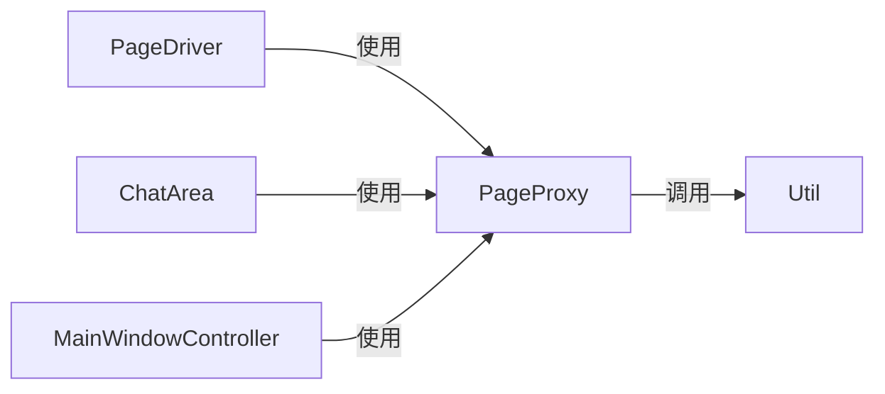
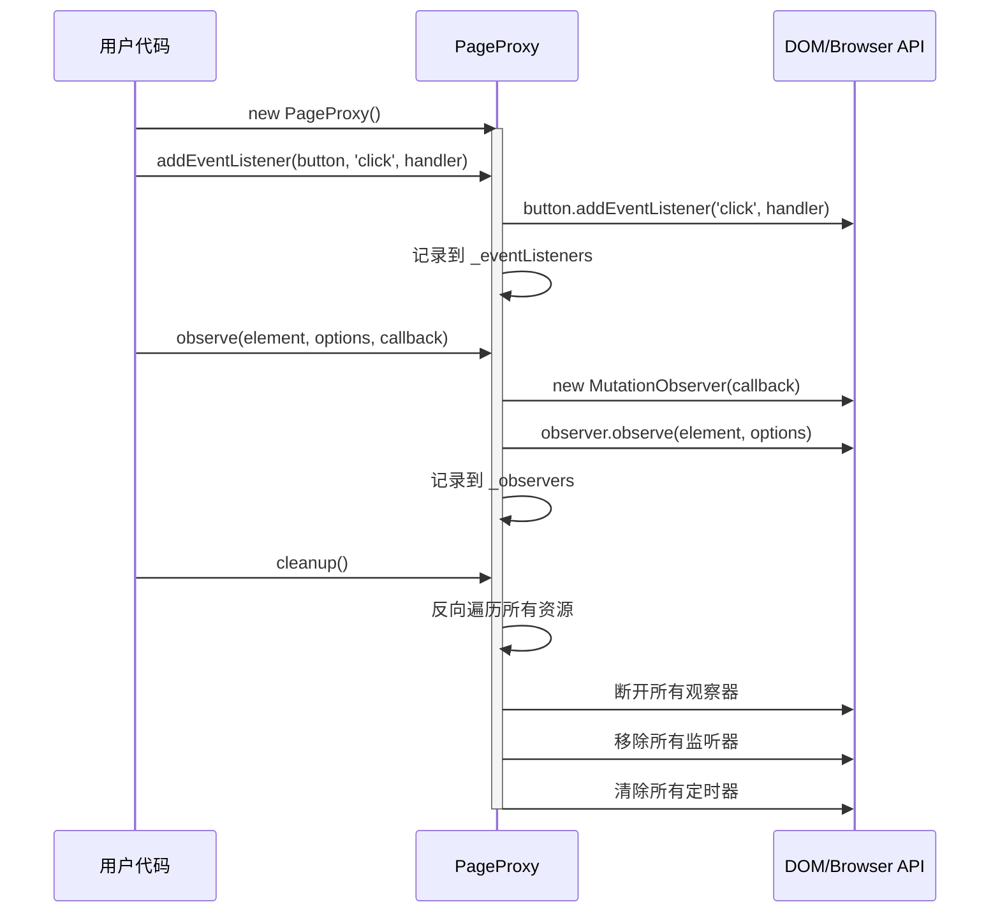

# 页面代理 (PageProxy) 设计文档

本文档遵循 [../GEMINI.MD](../GEMINI.MD) 和 [architect.md](./architect.md) 中的规范。

## 1. 逻辑视图 (Logical View)

### 模块职责

`PageProxy` 是一个 **资源管理器模式** 的实现，旨在统一管理页面上的所有监听器、观察器、定时器等资源，确保在需要时能够正确清理，避免内存泄漏。它的核心职责是：

1.  **资源注册与跟踪**: 自动记录通过 `PageProxy` 注册的所有资源（事件监听器、MutationObserver、定时器、history/location 监听等）。
2.  **统一清理接口**: 提供 `cleanup()` 方法一键清理所有已注册的资源，支持反向清理顺序（后注册的先清理）。
3.  **removeNotifier 机制**: 在注册资源时支持 `removeNotifier` 回调，允许资源在清理时进行自定义处理或阻止自动清理。

### 核心类

-   **`PageProxy`**: 资源管理器类，提供以下功能：
    -   `addEventListener` / `removeEventListener`: 事件监听器管理
    -   `observe` / `disconnectObserver`: MutationObserver 管理
    -   `setInterval` / `clearInterval`: 定时器管理
    -   `setTimeout` / `clearTimeout`: 延时器管理
    -   `onUrlChange` / `offUrlChange`: URL 变化监听管理
    -   `cleanup`: 统一清理所有资源
    -   `getResourceStats`: 获取资源统计信息

### 依赖关系

`PageProxy` 依赖 `Util` 模块来辅助进行 DOM 操作。可以被 `PageDriver`、`ChatArea`、`MainWindowController` 等需要管理资源的模块使用。



## 2. 过程视图 (Process View)

`PageProxy` 的使用流程：

1. 创建 `PageProxy` 实例
2. 使用 `PageProxy` 的方法注册各种资源
3. 在需要时调用 `cleanup()` 清理所有资源

### 交互示例：资源注册与清理



## 3. 开发视图 (Development View)

### 文件结构

-   `src/page-proxy.js`: 包含 `PageProxy` 类的实现。
-   `tests/page-proxy.test.js`: `PageProxy` 模块的单元测试。

### API 定义 (`PageProxy`)

```javascript
/**
 * @description 页面代理类，用于管理页面资源监听和清理。
 */
class PageProxy {
    /**
     * @description 添加事件监听器，并记录以便后续清理。
     * @param {EventTarget} target - 事件目标对象
     * @param {string} event - 事件名称
     * @param {Function} handler - 事件处理函数
     * @param {boolean|object} [options=false] - 事件选项
     * @param {Function} [removeNotifier] - 移除通知回调
     * @returns {boolean} 是否成功添加监听器
     */
    addEventListener(target, event, handler, options = false, removeNotifier) { /* ... */ }

    /**
     * @description 移除指定的事件监听器。
     * @param {EventTarget} target - 事件目标对象
     * @param {string} event - 事件名称
     * @param {Function} handler - 事件处理函数
     * @returns {boolean} 是否成功移除
     */
    removeEventListener(target, event, handler) { /* ... */ }

    /**
     * @description 创建 MutationObserver 并开始观察，同时记录以便后续清理。
     * @param {Node} target - 要观察的 DOM 节点
     * @param {MutationObserverInit} options - 观察选项
     * @param {MutationCallback} callback - 变化回调函数
     * @param {Function} [removeNotifier] - 移除通知回调
     * @returns {MutationObserver|null} 创建的 MutationObserver 实例
     */
    observe(target, options, callback, removeNotifier) { /* ... */ }

    /**
     * @description 断开 MutationObserver 的观察。
     * @param {MutationObserver} observer - 要断开的 MutationObserver 实例
     * @returns {boolean} 是否成功断开
     */
    disconnectObserver(observer) { /* ... */ }

    /**
     * @description 创建定时器（setInterval），并记录以便后续清理。
     * @param {Function} handler - 定时器处理函数
     * @param {number} delay - 延迟时间（毫秒）
     * @param {Array} [args] - 传递给处理函数的参数
     * @param {Function} [removeNotifier] - 移除通知回调
     * @returns {number|null} 定时器 ID
     */
    setInterval(handler, delay, args, removeNotifier) { /* ... */ }

    /**
     * @description 清除定时器。
     * @param {number} id - 定时器 ID
     * @returns {boolean} 是否成功清除
     */
    clearInterval(id) { /* ... */ }

    /**
     * @description 创建延时器（setTimeout），并记录以便后续清理。
     * @param {Function} handler - 延时器处理函数
     * @param {number} delay - 延迟时间（毫秒）
     * @param {Array} [args] - 传递给处理函数的参数
     * @param {Function} [removeNotifier] - 移除通知回调
     * @returns {number|null} 延时器 ID
     */
    setTimeout(handler, delay, args, removeNotifier) { /* ... */ }

    /**
     * @description 清除延时器。
     * @param {number} id - 延时器 ID
     * @returns {boolean} 是否成功清除
     */
    clearTimeout(id) { /* ... */ }

    /**
     * @description 监听 URL 变化（包括 pushState、replaceState、popstate、hashchange）。
     * @param {Function} callback - URL 变化时的回调函数
     * @param {Function} [removeNotifier] - 移除通知回调
     * @returns {Function|null} 取消监听的函数
     */
    onUrlChange(callback, removeNotifier) { /* ... */ }

    /**
     * @description 取消 URL 变化监听。
     * @param {Function} callback - 之前注册的回调函数
     * @returns {boolean} 是否成功取消
     */
    offUrlChange(callback) { /* ... */ }

    /**
     * @description 清理所有已注册的资源。
     * @returns {Object} 清理结果统计
     */
    cleanup() { /* ... */ }

    /**
     * @description 获取当前注册的资源统计信息。
     * @returns {Object} 资源统计信息
     */
    getResourceStats() { /* ... */ }
}
```

### removeNotifier 机制

`removeNotifier` 是一个可选的回调函数，在资源被清理之前调用。它接收关键参数并返回一个布尔值：
- 返回 `false`: 阻止自动清理原生资源（如调用 `removeEventListener`），但内部记录仍会被清除
- 返回 `true` 或 `undefined`: 继续正常清理流程

**重要**：无论 `removeNotifier` 返回什么值，PageProxy 的内部数据都会被清除。返回 `false` 只是阻止对原生资源的自动清理操作，允许 `removeNotifier` 自行处理。

**参数传递**：
- `addEventListener`: `removeNotifier(target, event, handler, options)`
- `observe`: `removeNotifier(observer, target)`
- `setInterval`: `removeNotifier(id, handler, delay)`
- `setTimeout`: `removeNotifier(id, handler, delay)`
- `onUrlChange`: `removeNotifier(callback)`

```javascript
// 使用示例
pageProxy.addEventListener(button, 'click', handleClick, false, (target, event, handler, options) => {
    console.log('Removing listener for', event, 'on', target);
    // 自定义清理逻辑
    // 返回 false 可以阻止自动移除，此时需要自行处理清理
    return true; // 返回 false 阻止自动移除监听器
});
```

## 4. 物理视图 (Physical View)

`PageProxy` 的代码与项目其他部分一起被捆绑到 `multi-ai-sync-chat.user.js` 中。它可以被任何需要资源管理的模块使用。

## +1. 场景视图 (Scenarios)

### 场景：PageDriver 使用 PageProxy 管理资源

1.  `PageDriver` 创建一个 `PageProxy` 实例。
2.  `PageDriver` 调用 `pageProxy.observe()` 监听 DOM 变化。
3.  `PageDriver` 调用 `pageProxy.addEventListener()` 监听按钮点击。
4.  `PageDriver` 调用 `pageProxy.onUrlChange()` 监听 URL 变化。
5.  当需要停止监听时，`PageDriver` 调用 `pageProxy.cleanup()` 清理所有资源。

### 场景：ChatArea 使用 PageProxy 管理资源

1.  `ChatArea` 创建一个 `PageProxy` 实例。
2.  `ChatArea` 使用 `pageProxy.addEventListener()` 监听用户交互事件。
3.  当聊天区域被销毁时，`ChatArea` 调用 `pageProxy.cleanup()` 确保没有内存泄漏。

## 测试用例设计

测试用例位于 `tests/page-proxy.test.js`，包括：

1.  **构造函数和初始化**: 验证 `PageProxy` 正确初始化
2.  **addEventListener / removeEventListener**: 验证事件监听器的添加、移除、参数验证和 `removeNotifier` 机制
3.  **observe / disconnectObserver**: 验证 MutationObserver 的创建、断开、参数验证和 `removeNotifier` 机制
4.  **setInterval / clearInterval**: 验证定时器的创建、清除、参数验证和 `removeNotifier` 机制
5.  **setTimeout / clearTimeout**: 验证延时器的创建、清除、参数验证和 `removeNotifier` 机制
6.  **onUrlChange / offUrlChange**: 验证 URL 变化监听的注册、取消、`removeNotifier` 机制
7.  **cleanup**: 验证批量清理所有资源的功能
8.  **查询方法**: 验证资源统计和查询功能
9.  **集成测试**: 验证多种资源的混合管理和清理

## 附录

### 资源类型

PageProxy 管理以下类型的资源：

| 资源类型 | 存储属性 | 清理方法 |
|---------|---------|---------|
| 事件监听器 | `_eventListeners` | `target.removeEventListener()` |
| MutationObserver | `_observers` | `observer.disconnect()` |
| 定时器 | `_intervals` | `clearInterval()` |
| 延时器 | `_timeouts` | `clearTimeout()` |
| URL 监听 | `_historyListeners` | 恢复原始方法 + 移除事件监听 |
