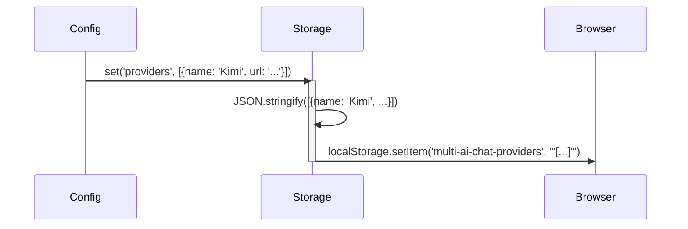
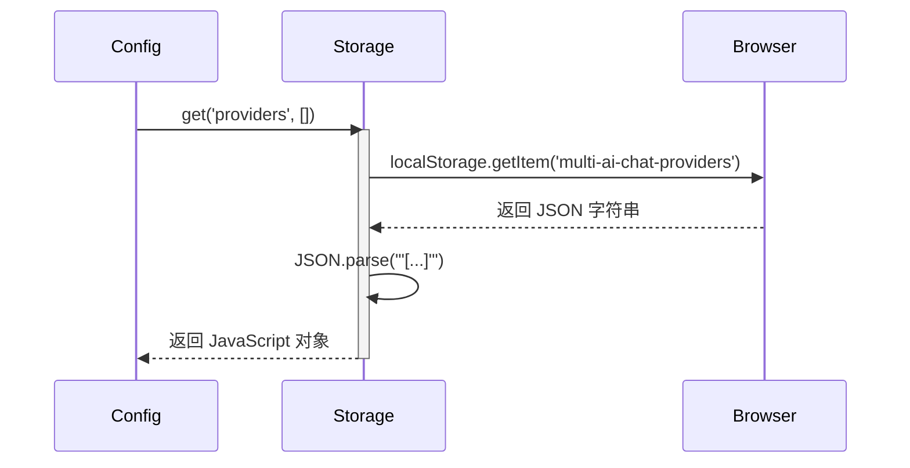

# 持久存储 (Storage) 设计文档

本文档遵循 [../GEMINI.MD](../GEMINI.MD) 和 [architect.md](./architect.md) 中的规范。

## 1. 逻辑视图 (Logical View)

### 模块职责

`Storage` 模块负责提供一个简单的、基于键值对的持久化存储机制。它作为浏览器 `localStorage` 的一层薄封装，主要目的是：

1.  **统一接口**: 提供一致的 `get` 和 `set` 方法，隐藏 `localStorage` 的原生 API 细节。
2.  **自动序列化**: 在存储时自动将 JavaScript 对象和数组序列化为 JSON 字符串，在读取时自动反序列化，使上层模块（如 `Config`）可以无缝地处理复杂数据结构。
3.  **错误处理**: 封装 `try...catch` 块，以优雅地处理 `localStorage` 可能出现的异常（例如，存储已满或被禁用）。

### 核心功能

-   `set(key, value)`: 将一个值（任何可序列化的类型）与一个键关联，并存入 `localStorage`。
-   `get(key, defaultValue)`: 根据键从 `localStorage` 中检索一个值。如果键不存在，则返回 `defaultValue`。
-   `remove(key)`: 从 `localStorage` 中删除一个键值对。

## 2. 过程视图 (Process View)

`Storage` 模块是被动的。它仅在被 `Config` 模块调用时执行操作。它不与其他模块直接交互。

### 交互示例：保存配置



### 交互示例：读取配置



## 3. 开发视图 (Development View)

### 文件结构

-   `src/storage.js`: `Storage` 模块的源代码。
-   `tests/storage.test.js`: `Storage` 模块的单元测试。

### API 定义

```javascript
/**
 * @description 封装 localStorage 提供持久化存储。
 */
function Storage() {
    const PREFIX = 'multi-ai-chat-';

    /**
     * @description 将键值对存入 localStorage。
     * @param {string} key - 键名。
     * @param {*} value - 要存储的值。
     */
    this.set = function(key, value) { /* ... */ };

    /**
     * @description 从 localStorage 读取键对应的值。
     * @param {string} key - 键名。
     * @param {*} [defaultValue] - 如果未找到，返回的默认值。
     * @returns {*} - 存储的值或默认值。
     */
    this.get = function(key, defaultValue) { /* ... */ };

    /**
     * @description 从 localStorage 中移除一个键。
     * @param {string} key - 键名。
     */
    this.remove = function(key) { /* ... */ };
}
```

## 4. 物理视图 (Physical View)

与 `Util` 模块类似，`Storage` 模块也是项目的一部分，被 Webpack 捆绑到最终的 `multi-ai-sync-chat.user.js` 文件中。它依赖于浏览器环境提供的 `localStorage` API。

## +1. 场景视图 (Scenarios)

### 场景：用户更改了 AI 提供商列表

1.  用户在主窗口的配置界面中添加或删除了一个 AI 提供商。
2.  主窗口的 `Config` 模块捕获到这个变化。
3.  `Config` 模块调用 `Storage.set('providers', newProviderList)`。
4.  `Storage` 模块将新的提供商列表（一个 JavaScript 数组）序列化为 JSON 字符串，并将其保存到 `localStorage` 中，键为 `multi-ai-chat-providers`。
5.  当用户下次打开浏览器或刷新页面时，`Config` 模块会通过 `Storage.get('providers')` 重新加载这个列表，从而保持用户的设置。


## **研究工作**

本模块比较简单，无特别研究工作

## **测试用例设计**

本模块的测试用例列表如下：

1. 获取一个不存在的key为`a.b.c`，返回null值
2. 获取一个不存在的key为`a.b.c`，但是指定默认返回值`abc`，则返回`abc`
3. 设置key为`a.b.c`对应的值为100，读取key为`a.b.c`的值，返回100。再读取`a.b`的值，返回null

## 附录

无附录
