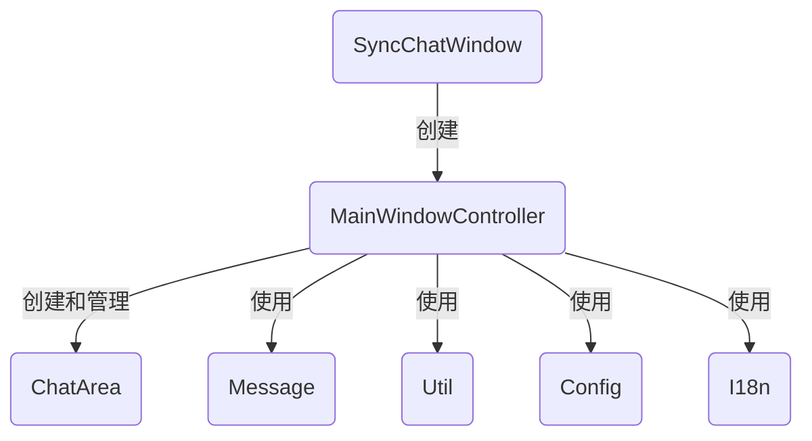
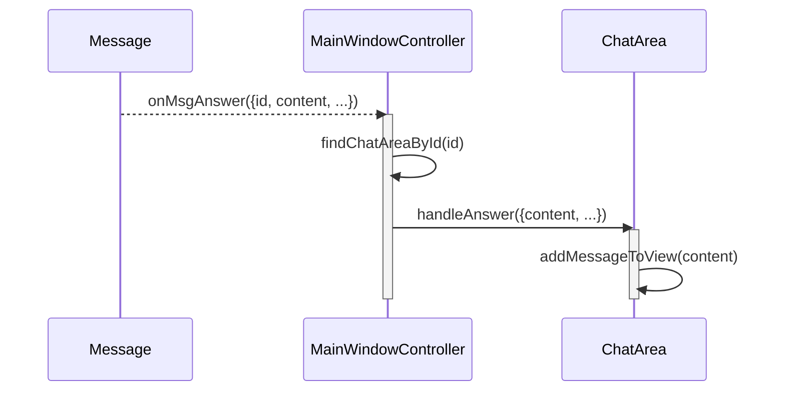

# 主窗口 (SyncChatWindow) 设计文档

本文档遵循 [../GEMINI.MD](../GEMINI.MD) 和 [architect.md](./architect.md) 中的规范。

## 1. 逻辑视图 (Logical View)

### 模块职责

主窗口 (`SyncChatWindow`) 是用户与多个 AI 进行同步交互的核心界面。它作为一个独立的浏览器窗口或 Tab 存在，其控制逻辑由 `MainWindowController` 类驱动。主要职责是：

1.  **UI 布局管理**: 负责主窗口的整体布局，包括顶部的工具栏、中间的内容块区域和底部的全局输入栏。支持动态切换多种布局（如 1, 2, 3, 4, 6 列/格）。
2.  **内容块 (ChatArea) 管理**: 作为 `ChatArea` 实例的容器和工厂。它负责根据来自原生页面的 `create` 消息创建、管理和销毁 `ChatArea` 实例。
3.  **全局交互处理**: 处理全局性的用户操作，例如在底部通用输入框中输入问题并分发给所有的 `ChatArea`，或响应布局切换、新建对话等按钮点击事件。
4.  **消息路由**: 监听并处理来自原生页面的消息（如 `answer`），并准确地将这些消息路由到对应的 `ChatArea` 实例进行处理。

`SyncChatWindow`类的主要功能是检测并创建主窗口的页面，组装好页面的HTML和`MainWindowController`并且管理类的依赖关系。其主要职责是：

1. **检查窗口是否存在**：提供接口检查主窗口是否已经存在
2. **创建主窗口**：创建主窗口的HTML框架和需要使用的javascript代码。
3. **检查并激活主窗口**：提供一个统一的接口，检查主窗口是否存在，如果没有则创建主窗口。最后激活主窗口。

### 核心类与依赖

-   **`SyncChatWindow`**：主窗口的创建。
-   **`MainWindowController`**: 主窗口的核心驱动类。
-   **依赖关系**:
    -   `ChatArea`: 创建和管理的子组件。
    -   `Message`: 用于与原生页面进行双向通信。
    -   `Util`: 用于 DOM 操作和 UI 创建。
    -   `Config`: 用于获取和设置布局、AI 提供商列表等配置。
    -   `I18n`: 用于显示国际化的 UI 文本。



## 2. 过程视图 (Process View)

主窗口的生命周期由 `PageController` 调用`SyncChatWindow`启动。一旦创建并加载了其 HTML 和脚本，`MainWindowController` 就会初始化，并开始监听消息。

### 布局和交互说明

主窗口的布局分为三个部分，从上到下分别为：

* 标题栏，分为左中右三个区域，水平划分如下：
  * 左区：从左到右包含产品图标、产品名称、多国语言切换。其中多国语言切换为地球形状，点击出现语言列表，选择之后界面语言切换到选定语言。
  * 中区：包含1、2、4、6布局切换按钮。
  * 右区：包含关闭窗口按钮。
* 内容块区域：根据布局排列内容块
* 提示词输入区：所有元素垂直居中，从左到右包含模型参数切换按钮、文本框和发送按钮。其中模型参数切换按钮是一个固定大小的齿轮，点击之后出现各种开关的选项，发送按钮也是固定大小，文本框填充剩余宽度，并且可以跟随文本内容而变高，在高于五分之一窗口或300px的时候就不再变高，而是出现滚动条。

### 交互示例：接收新答案并更新内容块



## 3. 开发视图 (Development View)

### 文件结构

-   `src/sync-chat-window.js`:`SyncChatWindow`和 `MainWindowController` 的源代码。
-   `tests/sync-chat-window.test.js`:`SyncChatWindow`和  `MainWindowController` 模块的单元测试。

### API 定义 (`MainWindowController`)

```javascript
/**
 * @description 主窗口的检查和创建类
 */
function SyncChatWindow(){
    /**
     * @description 初始化。
     */
    this.init = function() { /* ... */ };
 
    /**
     * @description 检查主窗口是否已经存在。  
     * @returns {boolean} true表示已经存在，false表示不存在
     */
    this.exist = function() { /* ... */ }; 
  
    /**
     * @description 创建主窗口，填充框架代码和依赖的脚本。    
     * @param {HTMLElement} doc - 所创建窗口的document对象
     * @returns 
     */
    this.createWindow = function(doc) { /* ... */ };
  
     /**
     * @description 检查并创建窗口。    
     * @returns 
     */
    this.checkAndCreateWindow = function() { /* ... */ };  
}

/**
 * @description 主窗口的核心控制器。
 * @param {object} args - 构造函数参数。
 */
function MainWindowController(args) {
    this.message = args.message;
    this.config = args.config;
    this.chatAreas = new Map();

    /**
     * @description 初始化，渲染布局，注册消息监听。
     */
    this.init = function() { /* ... */ };

    /**
     * @description 处理来自原生页面的创建内容块的消息。
     * @param {object} data - 消息数据 (url, title, id, ...)。
     */
    this.onMsgCreate = function(data) { /* ... */ };

    /**
     * @description 处理来自原生页面的答案消息。
     * @param {object} data - 消息数据 (id, content, ...)。
     */
    this.onMsgAnswer = function(data) { /* ... */ };

    /**
     * @description 添加一个新的 ChatArea 实例。
     * @param {object} data - ChatArea 的初始化数据。
     */
    this.addChatArea = function(data) { /* ... */ };

    /**
     * @description 从主窗口移除一个 ChatArea。
     * @param {string} id - ChatArea 的唯一标识符。
     */
    this.removeChatArea = function(id) { /* ... */ };
}
```

## 4. 物理视图 (Physical View)

主窗口是一个独立的浏览器上下文（窗口或 Tab），其 `document` 由 `SyncChatWindow` 动态写入。`MainWindowController` 的代码和所有相关依赖（`ChatArea`, `Util` 等）都被包含在这份动态生成的 HTML 中。它通过 `BroadcastChannel` 与运行在其他 Tab 中的 `PageController` 实例进行通信。

## +1. 场景视图 (Scenarios)

### 场景：用户在两个不同网站上发起同步

1.  用户在 `kimi.ai` 上点击“同步对比”。`PageController` (Kimi) 通过`SyncChatWindow`创建主窗口，并发送 `create` 消息。`MainWindowController` 收到后，创建一个 `ChatArea` (Kimi)。
2.  用户切换到 `chat.openai.com` 所在的 Tab，再次点击“同步对比”。
3.  `PageController` (ChatGPT) 发现主窗口已存在，于是直接获取其句柄。
4.  `PageController` (ChatGPT) 发送一个 `create` 消息，其中包含 ChatGPT 的 URL 和会话信息。
5.  `MainWindowController` 收到第二个 `create` 消息，于是创建并添加第二个 `ChatArea` (ChatGPT) 到主窗口的布局中。
6.  现在主窗口并排显示了 Kimi 和 ChatGPT 两个内容块。
7.  用户在主窗口底部的全局输入框提问，`MainWindowController` 将 `chat` 消息广播出去，两个 `PageController` 都会收到并各自驱动自己的页面进行回答。


## **研究工作**

本模块比较重要，需要进行一些基础技术的研究。本系列研究生成的代码，需要在`webpack`中进行处理，将代码封装成油猴的脚本，使得开发人员可以直观感知和在浏览器中调试功能的完整性。本研究成果可以直接使用在注入的html中。

### 窗口创建

最终脚本名称为`main-window`。

油猴脚本监听宿主页面加载完成，并等待5秒之后，开始自动根据交互设计逻辑，生成主窗口页面代码，并替换宿主页面内容。其中的ChatArea区域可以用方框代替，但是相关的样式要包含。

## **测试用例设计**

本模块的测试用例列表如下，如果用例太大需要可以编码时候切换成更小的用例：

1. 测试`SyncChatWindow`创建主窗口之前，检查窗口exist应该返回false，创建主窗口之后再检查窗口exist应该返回true
2. 当前测试窗口中运行`SyncChatWindow.createWindow(doc)`，doc对应窗口中应该包含完整的框架代码。
3. 当前测试窗口中使用`SyncChatWindow`创建主窗口框架，并发出create消息，当前窗口中应该创建一个ChatArea
4. 在当前测试窗口中填充主窗口代码，并通过`MainWindowController`设置页面布局为2，持续创建2个ChatArea应该成功，但是创建第三个的时候也应该成功，但是布局自动变更为4。在ChatArea从4个继续创建的时候，布局要变成6，在6个ChatArea满的时候继续创建ChatArea应该返回失败。支持pin住ChatArea，切换布局的时候会优先使用pin住的对象，如果对象数量超过布局容纳，则隐藏其他ChatArea，在切换更多布局（如从2切换到6）的时候显示原来隐藏的ChatArea对象。
5. 在当前测试窗口中填充主窗口代码，在ChatArea中添加文字、修改模型各种参数，都应该获得Message消息通知
6. 在当前测试窗口中填充主窗口代码，在主窗口中添加提示词并发送，所有ChatArea都应该自动填入提示词，并发送Message消息给各自关联的消息对象

## 附录

无附录
