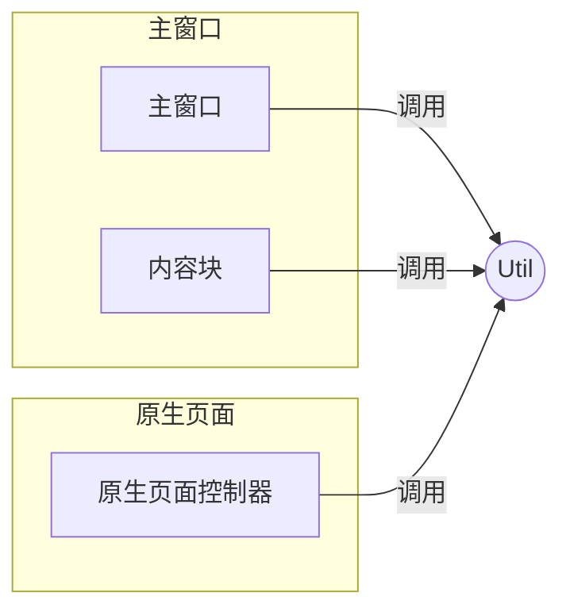

# 工具类 (Util) 设计文档

本文档遵循 [../GEMINI.MD](../GEMINI.MD) 和 [architect.md](./architect.md) 中的规范。

## 1. 逻辑视图 (Logical View)

### 模块职责

`Util` 模块是一个通用的、无状态的辅助函数集合，旨在简化和标准化整个项目中的常见任务。它封装了原生 DOM API、浏览器 API 和油猴 API，提供更简洁、更健壮的接口。

### 核心功能

-   **DOM 操作**: 提供类似于 jQuery 的选择器函数，用于快速查询和操作 DOM 元素。
    -   `$(selector, parent)`: 查询并返回匹配选择器的第一个元素。
    -   `$$(selector, parent)`: 查询并返回匹配选择器的所有元素组成的 `NodeList`。
-   **HTML 生成**: 提供将特定 JSON 结构转换为 HTML 元素的工具，该函数适用于小批量的HTML代码。
    -   `toHtml(json)`: 根据项目定义的 JSON 格式递归创建 HTML 元素。这是项目 **严禁拼接 HTML 字符串** 规范的技术实现核心。
-   **浏览器/油猴 API 封装**: 包装常用的 Web API 和 Greasemonkey API，以便于在项目其他部分统一调用和进行单元测试。

### JSON to HTML 结构定义

`toHtml` 函数接收的 JSON 对象结构如下所示：

```json
{
  "tag": "div",
  "@id": "my-div", "@class": "container",
  "@style": { "color": "red", "border", "1px" },
  "onclick": "() => console.log('Clicked!')",
  "children": [
    { "tag": "span", "text": "Hello" } },
    "World"
  ]
}
```

上述对应的html源码为：

```html
<div id="my-div" class="container" style="color:red;border:1px" onclick="() => console.log('Clicked!')">
  <span>Hello</span>World
</div>
```

其结构解释如下：

* tag：表示元素的标签类型，如div、span、body、script等HTML元素名称。
* 以`@`开头的key全部归纳为html的同名属性，如果属性值也是json，则直接转换为`;`分割的字符串，并且只取第一层。
* 以`on`开头的所有属性都解释为事件，如果是`Function`对象则自动调用`toString()`转换为源码，其他一律为字符串处理。
* `text`默认就是元素的文本内容
* 以`children`或`child`为名字的节点，则变成当前节点的下级节点。
* 如果只有名字但是没有值或值为null的节点，默认也是text部分
* 针对`{'script': 'print("hello")'}`这种省略`tag`的节点且放在第一个属性位置，则自动转换为html为`<script>print("hello")</script>`。如果随后还有其他`@`开头或`on`开头的属性则自动变成该节点的属性，但此种节点不能有`children`子节点，否则报错。

## 2. 过程视图 (Process View)

`Util` 模块是一个被动的、纯粹的服务提供者。它不包含任何业务流程或状态，也不会主动与其他模块通信。其他所有模块都可以根据需要直接调用 `Util` 提供的函数。

### 交互示例



## 3. 开发视图 (Development View)

### 文件结构

-   `src/util.js`: `Util` 模块的源代码。
-   `tests/util.test.js`: `Util` 模块的单元测试。

### API 定义 (部分)

```javascript
/**
 * @description 根据 JSON 对象创建 HTML 元素。
 * @param {object} json - 描述 HTML 结构的 JSON 对象。
 * @returns {HTMLElement} - 创建的 HTML 元素。
 */
function toHtml(json) { /* ... */ }

/**
 * @description 查询并返回匹配选择器的第一个 DOM 元素。
 * @param {string} selector - CSS 选择器。
 * @param {HTMLElement|Document} [parent=document] - 查询的父节点。
 * @returns {HTMLElement|null}
 */
function $(selector, parent = document) { /* ... */ }
```

## 4. 物理视图 (Physical View)

`Util` 模块本身不是一个可独立部署的单元。它作为项目的一部分，在构建阶段由 Webpack 捆绑到最终的 `multi-ai-sync-chat.user.js` 文件中。它在每个油猴脚本运行的上下文（原生页面和主窗口）中都会被加载和执行。

## +1. 场景视图 (Scenarios)

### 场景：内容块 (ChatArea) 创建其 UI

`ChatArea` 需要渲染一个包含标题和关闭按钮的面板。它不直接写 HTML，而是定义一个 JSON 结构，并调用 `Util.toHtml`。

**`ChatArea.js` 中的代码片段:**

```javascript
const Utils = require('./util');

function ChatArea() {
    this.createView = function() {
        const viewJson = {
            tag: 'div',
            '@class': 'chat-area',
            children: [
                {
                    tag: 'div',
                    '@class': 'header',
                    children: [
                        { tag: 'span', text: 'AI 对话' },
                        { tag: 'button', text: 'X' }
                    ]
                },
                {
                    tag: 'div',
                    '@class': 'content' 
                }
            ]
        };
        
        const element = Utils.toHtml(viewJson);
        return element;
    };
}
```

## **测试用例设计**

本模块的测试用例列表如下：

1. 测试`toHtml`函数的功能：
   1. 测试单个json的`{tag:'div', text:'hello'}`转换为`<div>hello</div>`
   2. 测试单个json的`{tag:'div', '@id':'id1',text:'hello'}`转换为`<div id='id1'>hello</div>`
   3. 测试单个json的`{tag:'div', '@style':{border:'1px'},text:'hello'}`转换为`<div style='border:1px'>hello</div>`
   4. 测试单个json的`{tag:'div', '@style':{border:'1px',color:'red'},text:'hello'}`转换为`<div style='border:1px;color:red'>hello</div>`
   5. 测试单个json的`{div:'hello'}`转换为`<div>hello</div>`
   6. 测试单个json的`{div:'hello', '@id':'id2'}`转换为`<div id='id2'>hello</div>`
   7. 测试单个json的`{tag:'div', text:'hello',child:[{span:'world'}]}`转换为`<div>hello<span>world</span></div>`
   8. 测试错误的简易格式`{div:'hello',child:[{span:'world'}]}`应该报错
   9. 测试script标准格式带函数`function abc(){print("1");}`,转换`{tag:'script', text:abc}`为`<script>function abc(){print("1");}</script>`；
   10. 测试上述的简易格式，转换`{script:abc}`为`<script>function abc(){print("1")}</script>`；
2. 测试DOM操作

## 附录

### 关于HTML代码生成的原则

在小批量的代码生成中，一般建议用`toHtml`函数。这个“小批量”的意思是body内的元素，层次嵌套不超过3层。

除此之外的情况下，如果要生成HTML，请直接使用字符串。尤其是如下几种情况：

* 要生成整体的HTML页面的时候，可以灵活运用嵌入变量。
* 有大量的css要嵌入

示例如下：

```javascript
// 生成完整HTML页面
const page = `
    <html>
        <head><title>Hello!</title></head>
        <body>
        	${util.toHtml(body_src)}
        </body>
        <script>${ABC_Script.toString()}</script>
    </html>
`;
```


